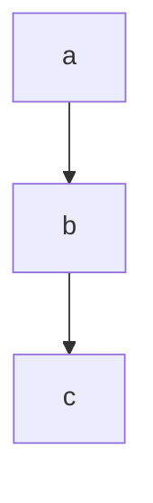
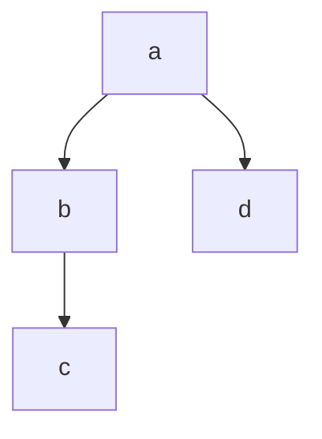
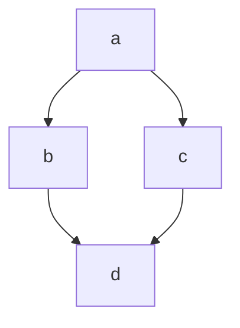
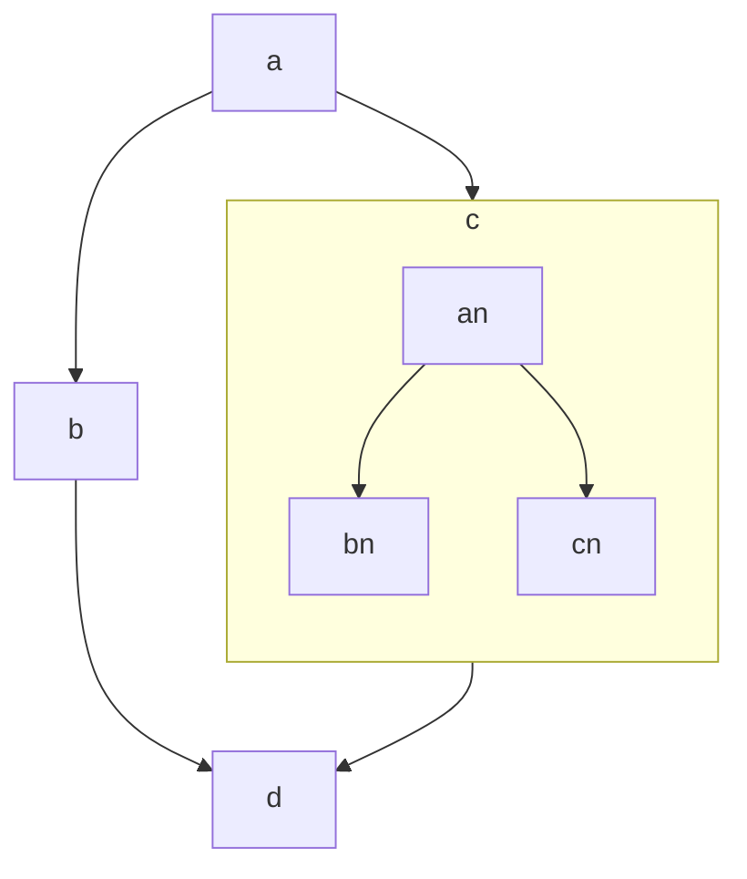
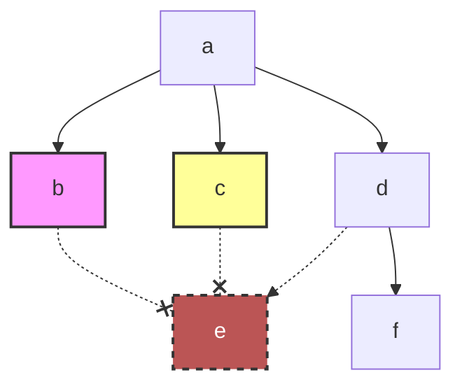
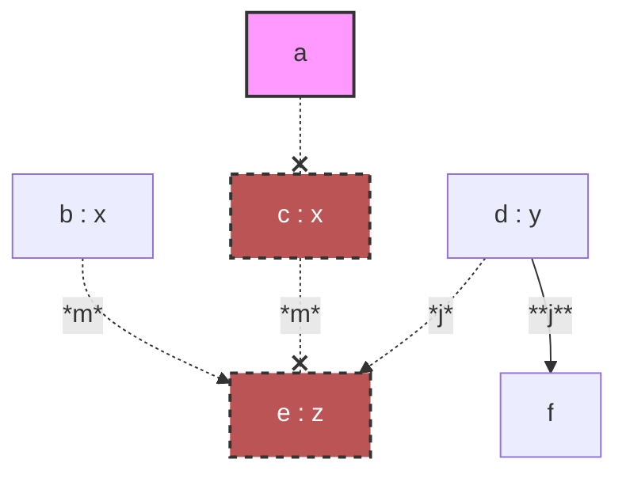
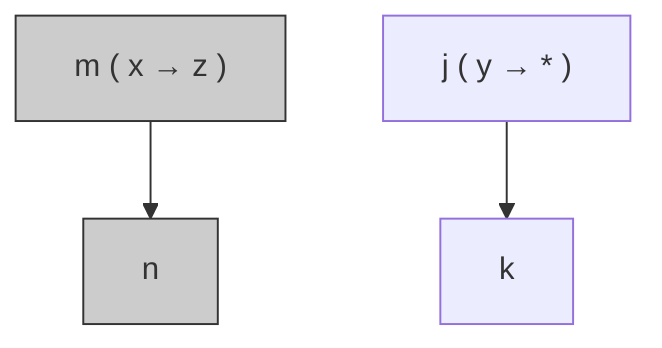

# `acyclic.h`

- 使用 C++20 协程和编译期拓扑规范来构建和执行异步有向无环图（DAG）的框架。
- 图中的节点与用户定义的标签类型相关联。数据沿着边流动，每个节点可以是一个普通函数、一个 awaitable，甚至另一个 acyclic 实例。
- 该库执行广泛的编译时检查：token 的唯一性、参数/结果的匹配、无环性以及函子签名的可推导性。
- 它支持自定义调度器、异常处理器以及面向切面的数据传输观测。

---

## 目录

1. [基本用法：线性链](#基本用法线性链)
2. [DAG 中的参数传递](#dag-中的参数传递)
3. [返回带有调度器注入的 Awaitable](#返回带有调度器注入的-awaitable)
4. [返回标准 C++ 协程](#返回标准-c-协程)
5. [嵌套 Acyclic 实例](#嵌套-acyclic-实例)
6. [异常处理](#异常处理)
7. [切面观测](#切面观测)
8. [Token 参考](#token-参考)

---

## 基本用法：线性链

### 简介

一个最小示例，定义了线性拓扑 `a → b → c`。每个节点都是一个简单的 lambda，打印其输入并返回一个转换后的值。一个就地调度器在任务提交时立即执行它们。

### 示例

```c++
#include <iostream>
#include "acyclic.h"
#include "type_format.h"

struct promise;
struct coroutine : std::coroutine_handle<promise>{using promise_type = struct promise;};
struct promise{
    coroutine get_return_object(){return {coroutine::from_promise(*this)};}
    std::suspend_never initial_suspend() const noexcept{return {};}
    std::suspend_never final_suspend() const noexcept{return {};}
    void return_void() const noexcept{}
    void unhandled_exception() const noexcept{}
};

int main()
{
    using namespace fake::literals;
    
    static constexpr auto print = [](fake::view_c auto _context, const auto &..._e){
        std::cout << fake::io::fancy<>(fake::tie(_context.data(), _e...)) << std::endl;
    };
    
    // in-place scheduler
    struct in_place{void execute(std::function<void()> &&_delegate){_delegate();}};
    in_place sched;
    
    // node tags
    struct a{}; struct b{}; struct c{};
    
    // topology: a --> b; b --> c;
    using sequence = fake::top::sequence<a, b, c>;
    
    fake::acyclic_c auto acyclic = fake::bind<sequence>(
        fake::deliver(
            fake::pass<b>([](auto _x){print("b"_v, _x); return _x * 3 + 377.0;}),
            fake::pass<a>([](int _x, float _y){print("a"_v, _x, _y); return _x + _y - 114;}),
            fake::pass<fake::acyclic::token::sched<void>>(std::ref(sched)), // pass in any order
            fake::pass<c>([](auto _x){print("c"_v, _x); return _x;})
        )
    );
    
    [](auto _acyclic) -> coroutine {
        print("result"_v, co_await _acyclic(fake::pass<a>(114, 514)));
    }(std::move(acyclic));
}
```

**输出（纯文本，省略颜色）：**

```plain
fake::flat<char [2], int32_t, float> : {
|   char [2] 0 : "a",
|   int32_t 1 : 114,
|   float 2 : 514
}
fake::flat<char [2], float> : {
|   char [2] 0 : "b",
|   float 1 : 514
}
fake::flat<char [2], double> : {
|   char [2] 0 : "c",
|   double 1 : 1919
}
fake::flat<char [7], std::tuple<double>> : {
|   char [7] 0 : "result",
|   std::tuple<double> 1 : {
|   |   double 0 : 1919
|   }
}
```

### 图示



---

## DAG 中的参数传递

### 简介

此示例演示返回值如何分发到后续节点。展示了两种拓扑结构：

- 一个 **fork**，其中节点 `a` 有两个后继 `b` 和 `d`；节点 `b` 有一个后继 `c`，该后继期望两个参数。
- 一个 **diamond**，其中 `a` 分叉到 `b` 和 `c`，然后它们在 `d` 处汇合。

规则：

- 具有多个后继的节点返回一个 `std::tuple`，其元素按拓扑中声明的顺序分发给后继。
- 如果后继期望多个参数，则对应的 tuple 元素本身必须是一个 tuple。
- 允许返回 `void` 的节点；它们只是不贡献给结果 tuple。

### 示例

```c++
#include <iostream>
#include <list>
#include "acyclic.h"
#include "type_format.h"

struct promise;
struct coroutine : std::coroutine_handle<promise>{using promise_type = struct promise;};
struct promise{
    coroutine get_return_object(){return {coroutine::from_promise(*this)};}
    std::suspend_never initial_suspend() const noexcept{return {};}
    std::suspend_never final_suspend() const noexcept{return {};}
    void return_void() const noexcept{}
    void unhandled_exception() const noexcept{}
};

int main()
{
    using namespace fake::literals;
    
    static constexpr auto print = [](fake::view_c auto _context, const auto &..._e){
        std::cout << fake::io::fancy<>(fake::tie(_context.data(), _e...)) << std::endl;
    };
    
    // fifo scheduler
    struct fifo{
        void run(){std::size_t i{}; while(tasks.size()) print("loop"_v, i++), tasks.front()(), tasks.pop_front();}
        void execute(std::function<void()> &&_delegate){tasks.emplace_back(std::move(_delegate));}
        std::list<std::function<void()>> tasks;
    };
    fifo sched;
    
    // node tags
    struct a{}; struct b{}; struct c{}; struct d{};
    
    // topology: a --> b; b --> c; a --> d;
    using fork = fake::top::info<
        fake::top::meta<a, fake::top::results<b, d>, fake::top::args<>>,
        fake::top::meta<b, fake::top::results<c>, fake::top::args<a>>,
        fake::top::meta<c, fake::top::results<>, fake::top::args<b>>,
        fake::top::meta<d, fake::top::results<>, fake::top::args<a>>
    >;
    
    fake::acyclic_c auto frk = fake::bind<fork>(
        fake::deliver(
            fake::pass<fake::acyclic::token::sched<void>>(std::ref(sched)),
            fake::pass<a>([](int _x, float _y){print("a"_v, _x + _y); return std::tuple{_x + _y, _x + _y + 400};}),
            // a returns a tuple because it has two successors (b and d)
            // the tuple elements are distributed in the order of the results list: first to b, second to d.
            fake::pass<b>([](auto _x){print("b"_v, _x--); return std::make_tuple(std::tuple{_x * 2 + 893, _x + 297});}),
            // b returns a tuple-of-tuple because its only successor c expects two arguments.
            fake::pass<c>([](auto _x, auto _y){print("c"_v, _x, _y);}),
            fake::pass<d>([](auto _x){print("d"_v, _x); return "foobar"_v;})
        )
    );
    
    // topology: a --> b; a --> c; b --> d; c --> d
    using diamond = fake::top::info<
        fake::top::meta<a, fake::top::results<b, c>, fake::top::args<>>,
        fake::top::meta<b, fake::top::results<d>, fake::top::args<a>>,
        fake::top::meta<c, fake::top::results<d>, fake::top::args<a>>,
        fake::top::meta<d, fake::top::results<>, fake::top::args<b, c>>
    >;
    
    fake::acyclic_c auto dia = fake::bind<diamond>(
        fake::deliver(
            fake::pass<fake::acyclic::token::sched<void>>(std::ref(sched)),
            fake::pass<a>([](int _x, float _y){print("A"_v, _x + _y); return _x + _y;}),
            fake::pass<b>([](auto _a){print("B"_v, _a); return _a + 364;}),
            fake::pass<c>([](auto _a){print("C"_v, _a); return _a + 531;}),
            fake::pass<d>([](auto _b, auto _c){print("D"_v, _b, _c); return _b + _c - 232;})
        )
    );
    
    [](auto _frk) -> coroutine {print("result<fork>"_v, co_await _frk(fake::pass<a>(50, 64)));}(std::move(frk));
    [](auto _dia) -> coroutine {print("result<diamond>"_v, co_await _dia(fake::pass<a>(114, 514)));}(std::move(dia));
    
    sched.run();
}
```

**输出（纯文本，省略颜色）：**

```plain
fake::flat<char [5], uint64_t> : {
|   char [5] 0 : "loop",
|   uint64_t 1 : 0
}
fake::flat<char [2], float> : {
|   char [2] 0 : "a",
|   float 1 : 114
}
fake::flat<char [5], uint64_t> : {
|   char [5] 0 : "loop",
|   uint64_t 1 : 1
}
fake::flat<char [2], float> : {
|   char [2] 0 : "A",
|   float 1 : 628
}
fake::flat<char [5], uint64_t> : {
|   char [5] 0 : "loop",
|   uint64_t 1 : 2
}
fake::flat<char [2], float> : {
|   char [2] 0 : "b",
|   float 1 : 114
}
fake::flat<char [2], float, float> : {
|   char [2] 0 : "c",
|   float 1 : 1119,
|   float 2 : 410
}
fake::flat<char [5], uint64_t> : {
|   char [5] 0 : "loop",
|   uint64_t 1 : 3
}
fake::flat<char [2], float> : {
|   char [2] 0 : "d",
|   float 1 : 514
}
fake::flat<char [13], std::tuple<fake::view<'foobar'>>> : {
|   char [13] 0 : "result<fork>",
|   std::tuple<fake::view<'foobar'>> 1 : {
|   |   fake::view<'foobar'> 0 : {
|   |   |
|   |   }
|   }
}
fake::flat<char [5], uint64_t> : {
|   char [5] 0 : "loop",
|   uint64_t 1 : 4
}
fake::flat<char [2], float> : {
|   char [2] 0 : "B",
|   float 1 : 628
}
fake::flat<char [5], uint64_t> : {
|   char [5] 0 : "loop",
|   uint64_t 1 : 5
}
fake::flat<char [2], float> : {
|   char [2] 0 : "C",
|   float 1 : 628
}
fake::flat<char [5], uint64_t> : {
|   char [5] 0 : "loop",
|   uint64_t 1 : 6
}
fake::flat<char [2], float, float> : {
|   char [2] 0 : "D",
|   float 1 : 992,
|   float 2 : 1159
}
fake::flat<char [16], std::tuple<float>> : {
|   char [16] 0 : "result<diamond>",
|   std::tuple<float> 1 : {
|   |   float 0 : 1919
|   }
}
```

### 图示

**Fork 拓扑：**



**Diamond 拓扑：**



---

## 返回带有调度器注入的 Awaitable

### 简介

节点可以返回一个 **awaitable**，它会挂起图的执行，直到 awaitable 完成。该库支持两种协议：

- 标准 C++ 协程协议（`await_ready`, `await_suspend`, `await_resume`）。
- 扩展协议 `await_inject(std::coroutine_handle<>, Scheduler&&)`，它接收与节点关联的调度器。这允许 awaitable 为自己的操作使用节点的调度器。

在此示例中，token `b` 和 `c` 继承自 `fake::acyclic::token::share<timer>`，它将用户定义的 `timer` 类型适配到注入的调度器协议。`timer` 的 `await_inject` 创建一个线程，并使用提供的调度器（全局线程调度器）来恢复协程。

### 示例

```c++
#include <print>
#include <sstream>
#include <list>
#include <thread>
#include "acyclic.h"
#include "type_format.h"

struct promise;
struct coroutine : std::coroutine_handle<promise>{using promise_type = struct promise;};
struct promise{
    coroutine get_return_object(){return {coroutine::from_promise(*this)};}
    std::suspend_never initial_suspend() const noexcept{return {};}
    std::suspend_never final_suspend() const noexcept{return {};}
    void return_void() const noexcept{}
    void unhandled_exception() const noexcept{}
};

struct timer{
    bool await_ready() const{return time == 0;}
    void await_inject(std::coroutine_handle<> _h, auto &&_sched) const{
        std::println("@ timer spawns a thread @");
        _sched.execute([h = std::move(_h), t = time]{std::this_thread::sleep_for(std::chrono::milliseconds{t}); h();});
    }
    auto await_resume() const{return "time = " + std::to_string(time) + ", dummy = " + std::to_string(dummy);}
    
public:
    uint64_t time = {};
    uint64_t dummy = 893;
};

int main()
{
    using namespace fake::literals;
    
    static constexpr auto print = [](fake::view_c auto _context, const auto &..._e){
        std::ostringstream oss;
        oss << fake::io::fancy<>(fake::tie(_context.data(), _e...));
        std::println("{}", oss.str());
    };
    
    // thread scheduler
    struct thread{
        std::size_t size(){fake::atomic::read guard(mutex); return tasks.size();};
        void join(){
            while(size()){
                std::thread* ptr;
                {fake::atomic::read guard(mutex); ptr = &tasks.front();}
                {ptr->join(); fake::atomic::write guard(mutex); tasks.pop_front();}
            }
        }
        void execute(std::function<void()> &&_delegate){
            fake::atomic::write guard(mutex);
            print("loop"_v, i++), tasks.emplace_back(std::move(_delegate));
        }
        ~thread(){join();}
        std::size_t i{};
        fake::atomic::guard mutex;
        std::list<std::thread> tasks;
    };
    thread sched;
    
    // bind reverse injection awaitable 'timer'
    using time = fake::acyclic::token::share<timer>;
    
    // node tags
    struct a{}; struct b : time{}; struct c : time{}; struct d{};
    
    // topology: a --> c; a --> b; c --> d; b --> d;
    using fork = fake::top::info<
        fake::top::meta<a, fake::top::results<c, b>, fake::top::args<>>,
        fake::top::meta<b, fake::top::results<d>, fake::top::args<a>>,
        fake::top::meta<c, fake::top::results<d>, fake::top::args<a>>,
        fake::top::meta<d, fake::top::results<>, fake::top::args<c, b>>
    >;
    
    fake::acyclic_c auto acyclic = fake::bind<fork>(
        fake::deliver(
            fake::pass<fake::acyclic::token::sched<void>>(std::ref(sched)),
            fake::pass<a>([](int _x){print("a"_v, _x); return std::tuple{_x + 400, _x + 250};}),
            fake::pass<b>([](auto _x){print("b"_v, _x); return _x - 364;}),
            fake::pass<c>([](auto _x){print("c"_v, _x); return fake::pass(810, 1919);}),
            fake::pass<d>([](const auto &_b, const auto &_c){print("d"_v, _b, _c); return std::pair{_b, _c};})
        )
    );
    
    [](auto _acyclic) -> coroutine {print("result"_v, co_await _acyclic(fake::pass<a>(114)));}(std::move(acyclic));
    [](auto _acyclic) -> coroutine {print("result"_v, co_await _acyclic(fake::pass<a>(514)));}(std::move(acyclic));
}
```

**输出（纯文本，省略颜色）：**

```plain
fake::flat<char [5], uint64_t> : {
|   char [5] 0 : "loop",
|   uint64_t 1 : 0
}
fake::flat<char [5], uint64_t> : {
|   char [5] 0 : "loop",
|   uint64_t 1 : 1
}
fake::flat<char [2], int32_t> : {
|   char [2] 0 : "a",
|   int32_t 1 : 514
}
fake::flat<char [2], int32_t> : {
|   char [2] 0 : "a",
|   int32_t 1 : 114
}
fake::flat<char [5], uint64_t> : {
|   char [5] 0 : "loop",
|   uint64_t 1 : 2
}
fake::flat<char [5], uint64_t> : {
|   char [5] 0 : "loop",
|   uint64_t 1 : 3
}
fake::flat<char [2], int32_t> : {
|   char [2] 0 : "c",
|   int32_t 1 : 914
}
fake::flat<char [5], uint64_t> : {
|   char [5] 0 : "loop",
|   uint64_t 1 : 4
}
@ timer spawns a thread @
fake::flat<char [2], int32_t> : {
|   char [2] 0 : "c",
|   int32_t 1 : 514
}
fake::flat<char [5], uint64_t> : {
|   char [5] 0 : "loop",
|   uint64_t 1 : 5
}
@ timer spawns a thread @
fake::flat<char [2], int32_t> : {
|   char [2] 0 : "b",
|   int32_t 1 : 764
}
fake::flat<char [5], uint64_t> : {
|   char [5] 0 : "loop",
|   uint64_t 1 : 6
}
fake::flat<char [2], int32_t> : {
|   char [2] 0 : "b",
|   int32_t 1 : 364
}
fake::flat<char [5], uint64_t> : {
|   char [5] 0 : "loop",
|   uint64_t 1 : 7
}
@ timer spawns a thread @
fake::flat<char [5], uint64_t> : {
|   char [5] 0 : "loop",
|   uint64_t 1 : 8
}
fake::flat<char [5], uint64_t> : {
|   char [5] 0 : "loop",
|   uint64_t 1 : 9
}
fake::flat<char [5], uint64_t> : {
|   char [5] 0 : "loop",
|   uint64_t 1 : 10
}
fake::flat<char [2], std::string, std::string> : {
|   char [2] 0 : "d",
|   std::string 1 : "time = 810, dummy = 1919",
|   std::string 2 : "time = 0, dummy = 893"
}
fake::flat<char [2], std::string, std::string> : {
|   char [2] 0 : "d",
|   std::string 1 : "time = 810, dummy = 1919",
|   std::string 2 : "time = 400, dummy = 893"
}
fake::flat<char [7], std::tuple<std::pair<std::string, std::string>>> : {
|   char [7] 0 : "result",
|   std::tuple<std::pair<std::string, std::string>> 1 : {
|   |   std::pair<std::string, std::string> 0 : {
|   |   |   std::string first : "time = 810, dummy = 1919",
|   |   |   std::string second : "time = 0, dummy = 893"
|   |   }
|   }
}
fake::flat<char [7], std::tuple<std::pair<std::string, std::string>>> : {
|   char [7] 0 : "result",
|   std::tuple<std::pair<std::string, std::string>> 1 : {
|   |   std::pair<std::string, std::string> 0 : {
|   |   |   std::string first : "time = 810, dummy = 1919",
|   |   |   std::string second : "time = 400, dummy = 893"
|   |   }
|   }
}
```

### 图示


---

## 返回标准 C++ 协程

### 简介

节点也可以返回遵循标准协议（`await_ready`, `await_suspend`, `await_resume`）的手写协程。在这种情况下，协程本身可能挂起和恢复，并且可以包含自己的 `co_await` 表达式。该库将这样的协程对象视为 awaitable。

在此示例中，节点 `b` 返回一个循环三次的协程，每次等待一个 `timer`，该 timer 会创建一个线程。这里的 `timer` **不**使用调度器注入；它显式地捕获调度器。

### 示例

```c++
#include <print>
#include <sstream>
#include <list>
#include <thread>
#include "acyclic.h"
#include "type_format.h"

struct promise;
struct coroutine : std::coroutine_handle<promise>{
    using promise_type = struct promise;
    inline void await_suspend(std::coroutine_handle<> _h);
    inline int await_resume() const;
    inline bool await_ready() const{return false;}
};
struct promise{
    coroutine get_return_object(){return {coroutine::from_promise(*this)};}
    std::suspend_always initial_suspend() const noexcept{return {};}
    std::suspend_never final_suspend() const noexcept{if(handle) handle(); return {};}
    void return_value(int _result) noexcept{result = _result;}
    void unhandled_exception() const noexcept{}
    
    std::coroutine_handle<> handle;
    int result;
};
inline void coroutine::await_suspend(std::coroutine_handle<> _h){promise().handle = _h; resume();}
inline int coroutine::await_resume() const{return promise().result;}

template<typename _Scheduler>
struct timer{
    bool await_ready() const{return time == 0;}
    void await_suspend(std::coroutine_handle<> _h) const{
        std::println("@ timer spawns a thread @");
        sched.execute([h = std::move(_h), t = time]{std::this_thread::sleep_for(std::chrono::milliseconds{t}); h();});
    }
    auto await_resume() const{return "time = " + std::to_string(time) + ", dummy = " + std::to_string(dummy);}
    
public:
    _Scheduler &sched;
    uint64_t time = {};
    uint64_t dummy = 893;
};

int main()
{
    using namespace fake::literals;
    
    static constexpr auto print = [](fake::view_c auto _context, const auto &..._e){
        std::ostringstream oss;
        oss << fake::io::fancy<>(fake::tie(_context.data(), _e...));
        std::println("{}", oss.str());
    };
    
    // thread scheduler
    struct thread{
        std::size_t size(){fake::atomic::read guard(mutex); return tasks.size();};
        void join(){
            while(size()){
                std::thread* ptr;
                {fake::atomic::read guard(mutex); ptr = &tasks.front();}
                {ptr->join(); fake::atomic::write guard(mutex); tasks.pop_front();}
            }
        }
        void execute(std::function<void()> &&_delegate){
            fake::atomic::write guard(mutex);
            print("loop"_v, i++), tasks.emplace_back(std::move(_delegate));
        }
        ~thread(){join();}
        std::size_t i{};
        fake::atomic::guard mutex;
        std::list<std::thread> tasks;
    };
    thread sched;
    
    // node tags
    struct a{}; struct b : fake::acyclic::token::await{}; struct c{}; struct d{};
    
    // topology: a --> b; a --> c; b --> d; c --> d;
    using diamond = fake::top::info<
        fake::top::meta<a, fake::top::results<b, c>, fake::top::args<>>,
        fake::top::meta<b, fake::top::results<d>, fake::top::args<a>>,
        fake::top::meta<c, fake::top::results<d>, fake::top::args<a>>,
        fake::top::meta<d, fake::top::results<>, fake::top::args<b, c>>
    >;
    
    fake::acyclic_c auto dia = fake::bind<diamond>(
        fake::deliver(
            fake::pass<fake::acyclic::token::sched<void>>(std::ref(sched)),
            fake::pass<a>([](int _x){print("a"_v, _x); return std::tuple(_x + 400, 1402);}),
            fake::pass<b>(
                [&sched](auto _x){
                    print("b"_v, _x);
                    return [](auto _x, auto &_sched) -> coroutine {
                        for(int i = 0; i < 3; i++)
                            print("coro"_v, _x++), co_await timer{_sched, 300};
                        co_return _x;
                    }(_x, sched);
                }
            ),
            fake::pass<c>([](auto _x){print("c"_v, _x); return _x;}),
            fake::pass<d>([](auto _x, auto _y){print("d"_v, _x + _y); return std::pair{_x, _y};})
        )
    );
    
    auto coro = [](auto _dia) -> coroutine {print("result"_v, co_await _dia(fake::pass<a>(114)));}(std::move(dia));
    coro(); // initial_suspend returns suspend_always, so we need to manually resume
}
```

**输出（纯文本，省略颜色）：**

```plain
fake::flat<char [5], uint64_t> : {
|   char [5] 0 : "loop",
|   uint64_t 1 : 0
}
fake::flat<char [2], int32_t> : {
|   char [2] 0 : "a",
|   int32_t 1 : 114
}
fake::flat<char [5], uint64_t> : {
|   char [5] 0 : "loop",
|   uint64_t 1 : 1
}
fake::flat<char [5], uint64_t> : {
|   char [5] 0 : "loop",
|   uint64_t 1 : 2
}
fake::flat<char [2], int32_t> : {
|   char [2] 0 : "b",
|   int32_t 1 : 514
}
@ timer spawns a thread @
fake::flat<char [2], int32_t> : {
|   char [2] 0 : "c",
|   int32_t 1 : 1402
}
fake::flat<char [5], uint64_t> : {
|   char [5] 0 : "loop",
|   uint64_t 1 : 3
}
fake::flat<char [5], int32_t> : {
|   char [5] 0 : "coro",
|   int32_t 1 : 514
}
@ timer spawns a thread @
fake::flat<char [5], uint64_t> : {
|   char [5] 0 : "loop",
|   uint64_t 1 : 4
}
fake::flat<char [5], int32_t> : {
|   char [5] 0 : "coro",
|   int32_t 1 : 515
}
@ timer spawns a thread @
fake::flat<char [5], uint64_t> : {
|   char [5] 0 : "loop",
|   uint64_t 1 : 5
}
fake::flat<char [5], int32_t> : {
|   char [5] 0 : "coro",
|   int32_t 1 : 516
}
fake::flat<char [5], uint64_t> : {
|   char [5] 0 : "loop",
|   uint64_t 1 : 6
}
fake::flat<char [2], int32_t> : {
|   char [2] 0 : "d",
|   int32_t 1 : 1919
}
fake::flat<char [7], std::tuple<std::pair<int32_t, int32_t>>> : {
|   char [7] 0 : "result",
|   std::tuple<std::pair<int32_t, int32_t>> 1 : {
|   |   std::pair<int32_t, int32_t> 0 : {
|   |   |   int32_t first : 517,
|   |   |   int32_t second : 1402
|   |   }
|   }
}
```

### 图示


---

## 嵌套 Acyclic 实例

### 简介

一个 acyclic 实例本身可以从节点返回；它将被变成一个 awaitable。这允许构建层次化的图：外部 DAG 可以包含作为完整内部 DAG 的节点。

在此示例中，外部 DAG 中的节点 `c` 返回一个嵌套的 acyclic 实例（`nest`），该实例拥有自己的三节点 DAG。外部 DAG 会等待内部 DAG 完成后再继续。

### 示例

```c++
#include <print>
#include <sstream>
#include <list>
#include <thread>
#include "acyclic.h"
#include "type_format.h"

struct promise;
struct coroutine : std::coroutine_handle<promise>{using promise_type = struct promise;};
struct promise{
    coroutine get_return_object(){return {coroutine::from_promise(*this)};}
    std::suspend_never initial_suspend() const noexcept{return {};}
    std::suspend_never final_suspend() const noexcept{return {};}
    void return_void() const noexcept{}
    void unhandled_exception() const noexcept{}
};

int main()
{
    using namespace fake::literals;
    
    static constexpr auto print = [](fake::view_c auto _context, const auto &..._e){
        std::ostringstream oss;
        oss << fake::io::fancy<>(fake::tie(_context.data(), _e...));
        std::println("{}", oss.str());
    };
    
    // thread scheduler
    struct thread{
        std::size_t size(){fake::atomic::read guard(mutex); return tasks.size();};
        void join(){
            while(size()){
                std::thread* ptr;
                {fake::atomic::read guard(mutex); ptr = &tasks.front();}
                {ptr->join(); fake::atomic::write guard(mutex); tasks.pop_front();}
            }
        }
        void execute(std::function<void()> &&_delegate){
            fake::atomic::write guard(mutex);
            print("loop"_v, i++), tasks.emplace_back(std::move(_delegate));
        }
        ~thread(){join();}
        std::size_t i{};
        fake::atomic::guard mutex;
        std::list<std::thread> tasks;
    };
    thread sched;
    
    // inner DAG node tags
    struct an{}; struct bn{}; struct cn{};
    
    // inner topology: an --> bn; an --> cn;
    using nest_t = fake::top::info<
        fake::top::meta<an, fake::top::results<bn, cn>, fake::top::args<>>,
        fake::top::meta<bn, fake::top::results<>, fake::top::args<an>>,
        fake::top::meta<cn, fake::top::results<>, fake::top::args<an>>
    >;
    
    // outer DAG node tags
    struct a{}; struct b{}; struct c : fake::acyclic::token::await, fake::acyclic::token::dupli{}; struct d{};
    
    // outer topology: a --> b; a --> c; b --> d; c --> d;
    using topology_t = fake::top::info<
        fake::top::meta<a, fake::top::results<b, c>, fake::top::args<>>,
        fake::top::meta<b, fake::top::results<d>, fake::top::args<a>>,
        fake::top::meta<c, fake::top::results<d>, fake::top::args<a>>,
        fake::top::meta<d, fake::top::results<>, fake::top::args<b, c>>
    >;
    
    // build inner acyclic instance
    fake::acyclic_c auto nest = fake::bind<nest_t>(
        fake::deliver(
            fake::pass<fake::acyclic::token::sched<void>>(std::ref(sched)),
            fake::pass<an>([](int _x){print("an"_v, _x); return std::tuple(_x + 1405, _x + 296);}),
            fake::pass<bn>([](auto _x){print("bn"_v, _x); return _x;}),
            fake::pass<cn>([](auto _x){print("cn"_v, _x); return _x;})
        )
    );
    
    // outer acyclic instance uses the inner one as node c
    fake::acyclic_c auto acyclic = fake::bind<topology_t>(
        fake::deliver(
            fake::pass<fake::acyclic::token::sched<void>>(std::ref(sched)),
            fake::pass<a>([](int _x){print("a"_v, _x); return std::tuple(_x, _x + 400);}),
            fake::pass<b>([](auto _x){print("b"_v, _x); return _x + 250;}),
            fake::pass<c>([n = std::move(nest)](auto _x){print("c"_v, _x); return n(fake::pass<an>(_x));}),
            fake::pass<d>([](auto _x, auto _y, auto _z){print("d"_v, _x, _y - _z - 216);})
        )
    );
    
    [](auto _acyclic) -> coroutine {print("result"_v, co_await _acyclic(fake::pass<a>(114)));}(std::move(acyclic));
}
```

**输出（纯文本，省略颜色）：**

```plain
fake::flat<char [5], uint64_t> : {
|   char [5] 0 : "loop",
|   uint64_t 1 : 0
}
fake::flat<char [2], int32_t> : {
|   char [2] 0 : "a",
|   int32_t 1 : 114
}
fake::flat<char [5], uint64_t> : {
|   char [5] 0 : "loop",
|   uint64_t 1 : 1
}
fake::flat<char [2], int32_t> : {
|   char [2] 0 : "b",
|   int32_t 1 : 114
}
fake::flat<char [5], uint64_t> : {
|   char [5] 0 : "loop",
|   uint64_t 1 : 2
}
fake::flat<char [2], int32_t> : {
|   char [2] 0 : "c",
|   int32_t 1 : 514
}
fake::flat<char [5], uint64_t> : {
|   char [5] 0 : "loop",
|   uint64_t 1 : 3
}
fake::flat<char [3], int32_t> : {
|   char [3] 0 : "an",
|   int32_t 1 : 514
}
fake::flat<char [5], uint64_t> : {
|   char [5] 0 : "loop",
|   uint64_t 1 : 4
}
fake::flat<char [5], uint64_t> : {
|   char [5] 0 : "loop",
|   uint64_t 1 : 5
}
fake::flat<char [3], int32_t> : {
|   char [3] 0 : "bn",
|   int32_t 1 : 1919
}
fake::flat<char [3], int32_t> : {
|   char [3] 0 : "cn",
|   int32_t 1 : 810
}
fake::flat<char [5], uint64_t> : {
|   char [5] 0 : "loop",
|   uint64_t 1 : 6
}
fake::flat<char [2], int32_t, int32_t> : {
|   char [2] 0 : "d",
|   int32_t 1 : 364,
|   int32_t 2 : 893
}
fake::flat<char [7], std::tuple<>> : {
|   char [7] 0 : "result",
|   std::tuple<> 1 : {
|   |
|   }
}
```

### 图示



---

## 异常处理

### 简介

该库允许使用 `fake::acyclic::token::spare<Group>` 将异常处理器与节点组关联。当属于该组的节点抛出未处理的异常时，处理器被调用。如果一个为其他节点产生数据的节点抛出异常，那些下游节点可能不会执行，除非它们不依赖于被丢弃的数据（即，它们返回 `void` 并且没有数据依赖）。

在此示例中，节点 `b` 和 `c`（属于组 `x` 和 `y`）抛出异常。异常由相应的处理器捕获。节点 `e` 依赖于 `b`、`c` 和 `d`；由于 `b` 和 `c` 抛出异常，`e` 永远不会运行。节点 `f` 仅依赖于 `d`，正常运行。acyclic 实例抛出的 `bad optional access` 异常最终通过 `co_await` 传递给协程，因为 acyclic 实例试图获取最终结果并 `await_resume` 它作为 `co_await` 表达式的返回值，但缺少来自 `e` 的返回数据。

### 示例

```c++
#include <print>
#include <sstream>
#include <list>
#include <thread>
#include "acyclic.h"
#include "type_format.h"

struct promise;
struct coroutine : std::coroutine_handle<promise>{using promise_type = struct promise;};
struct promise{
    coroutine get_return_object(){return {coroutine::from_promise(*this)};}
    std::suspend_never initial_suspend() const noexcept{return {};}
    std::suspend_never final_suspend() const noexcept{std::println("final_suspend()"); return {};}
    void return_void() const noexcept{}
    void unhandled_exception() const noexcept{std::println("unhandled_exception()");}
};

int main()
{
    using namespace fake::literals;
    
    static constexpr auto print = [](fake::view_c auto _context, const auto &..._e){
        std::ostringstream oss;
        oss << fake::io::fancy<>(fake::tie(_context.data(), _e...));
        std::println("{}", oss.str());
    };
    
    // thread scheduler
    struct thread{
        std::size_t size(){fake::atomic::read guard(mutex); return tasks.size();};
        void join(){
            while(size()){
                std::thread* ptr;
                {fake::atomic::read guard(mutex); ptr = &tasks.front();}
                {ptr->join(); fake::atomic::write guard(mutex); tasks.pop_front();}
            }
        }
        void execute(std::function<void()> &&_delegate){
            fake::atomic::write guard(mutex);
            print("loop"_v, i++), tasks.emplace_back(std::move(_delegate));
        }
        ~thread(){join();}
        std::size_t i{};
        fake::atomic::guard mutex;
        std::list<std::thread> tasks;
    };
    thread sched;
    
    // exception handler tags by group
    struct x{}; struct y{};
    
    // node tags
    struct a{}; struct b : x{}; struct c : y{}; struct d{}; struct e{}; struct f{};
    
    // topology: a --> b; a --> c; a --> d; b(throw) --> e; c(throw) --> e; d --> e; d --> f;
    using topology_t = fake::top::info<
        fake::top::meta<a, fake::top::results<b, c, d>, fake::top::args<>>,
        fake::top::meta<b, fake::top::results<e>, fake::top::args<a>>,
        fake::top::meta<c, fake::top::results<e>, fake::top::args<a>>,
        fake::top::meta<d, fake::top::results<e, f>, fake::top::args<a>>,
        fake::top::meta<e, fake::top::results<>, fake::top::args<b, c, d>>,
        fake::top::meta<f, fake::top::results<>, fake::top::args<d>>
    >;
    
    struct result final{std::string value = "node ignored";};
    
    fake::acyclic_c auto acyclic = fake::bind<topology_t>(
        fake::deliver(
            fake::pass<fake::acyclic::token::sched<void>>(std::ref(sched)),
            fake::pass<fake::acyclic::token::spare<x>>(
                []{
                    auto eptr = std::current_exception();
                    try{if(eptr) std::rethrow_exception(eptr);}catch(int _e){print("exception_handler<x>"_v, _e);}
                }
            ),
            fake::pass<fake::acyclic::token::spare<y>>(
                []{
                    auto eptr = std::current_exception();
                    try{if(eptr) std::rethrow_exception(eptr);}catch(int _e){print("exception_handler<y>"_v, _e);}
                }
            ),
            fake::pass<a>([]{print("a"_v); return std::tuple{114, 514, 1919};}),
            fake::pass<b>([](auto _x){print("b(throw)"_v); throw _x; return _x;}),
            fake::pass<c>([](auto _x){print("c(throw)"_v); throw _x; return _x;}),
            fake::pass<d>([](auto _x){print("d"_v); return std::tuple{_x, std::tuple{}};}),
            fake::pass<e>(
                [](auto _x, auto _y, auto _z){
                    print("e"_v, _x + _y + _z);
                    return result{"node<e> invoked"};
                }
            ),
            fake::pass<f>([]{print("f"_v); return result{"node<f> invoked"};})
        )
    );
    
    [](auto _acyclic) -> coroutine {
        fake::scope_guard guard{[]{std::println("~coroutine()");}};
        print("result"_v, co_await _acyclic(fake::pass<a>()));
    }(std::move(acyclic));
    
    sched.join();
    
    std::println("~main()");
}
```

**输出（纯文本，省略颜色）：**

```plain
fake::flat<char [5], uint64_t> : {
|   char [5] 0 : "loop",
|   uint64_t 1 : 0
}
fake::flat<char [2]> : {
|   char [2] 0 : "a"
}
fake::flat<char [5], uint64_t> : {
|   char [5] 0 : "loop",
|   uint64_t 1 : 1
}
fake::flat<char [5], uint64_t> : {
|   char [5] 0 : "loop",
|   uint64_t 1 : 2
}
fake::flat<char [9]> : {
|   char [9] 0 : "b(throw)"
}
fake::flat<char [5], uint64_t> : {
|   char [5] 0 : "loop",
|   uint64_t 1 : 3
}
fake::flat<char [21], int32_t> : {
|   char [21] 0 : "exception_handler<x>",
|   int32_t 1 : 114
}
fake::flat<char [9]> : {
|   char [9] 0 : "c(throw)"
}
fake::flat<char [2]> : {
|   char [2] 0 : "d"
}
fake::flat<char [21], int32_t> : {
|   char [21] 0 : "exception_handler<y>",
|   int32_t 1 : 514
}
fake::flat<char [5], uint64_t> : {
|   char [5] 0 : "loop",
|   uint64_t 1 : 4
}
fake::flat<char [2]> : {
|   char [2] 0 : "f"
}
~coroutine()
unhandled_exception()
final_suspend()
~main()
```

### 图示



---

## 切面观测

### 简介

切面是附着在节点间数据传输上的观测点。它们可以拦截从源节点流向目标节点的数据，可能修改它，并将其传递下去。切面由一个单独的 DAG（`aspect_t`）定义，其节点在相应的传输发生时被触发。

在此示例中，我们定义了两个切面链：

- `m → n` 观测从组 `x` 中的任何节点到组 `z` 中的任何节点的传输。
- `j → k` 观测从组 `y` 中的任何节点到任何节点（`void` 匹配任意节点）的传输。由于节点 `e`（属于组 `z`）因异常而未运行，`m→n` 链不会被触发。`j→k` 链针对传输 `d→f` 被触发。

切面可以修改数据；这里 `j` 在将观测值传递给 `k` 并最终传递给目标节点 `f` 之前将其取反。

### 示例

```c++
#include <print>
#include <sstream>
#include <list>
#include <thread>
#include <memory>
#include "acyclic.h"
#include "type_format.h"

struct promise;
struct coroutine : std::coroutine_handle<promise>{using promise_type = struct promise;};
struct promise{
    coroutine get_return_object(){return {coroutine::from_promise(*this)};}
    std::suspend_never initial_suspend() const noexcept{return {};}
    std::suspend_never final_suspend() const noexcept{std::println("final_suspend()"); return {};}
    void return_void() const noexcept{}
    void unhandled_exception() const noexcept{std::println("unhandled_exception()");}
};

int main()
{
    using namespace fake::literals;
    
    static constexpr auto print = [](fake::view_c auto _context, const auto &..._e){
        std::ostringstream oss;
        oss << fake::io::fancy<>(fake::tie(_context.data(), _e...));
        std::println("{}", oss.str());
    };
    
    // thread scheduler
    struct thread{
        std::size_t size(){fake::atomic::read guard(mutex); return tasks.size();};
        void join(){
            while(size()){
                std::thread* ptr;
                {fake::atomic::read guard(mutex); ptr = &tasks.front();}
                {ptr->join(); fake::atomic::write guard(mutex); tasks.pop_front();}
            }
        }
        void execute(std::function<void()> &&_delegate){
            fake::atomic::write guard(mutex);
            print("loop"_v, i++), tasks.emplace_back(std::move(_delegate));
        }
        ~thread(){join();}
        std::size_t i{};
        fake::atomic::guard mutex;
        std::list<std::thread> tasks;
    };
    thread sched;
    
    // group tags
    struct x{}; struct y{}; struct z{}; struct p{};
    
    // node tags
    struct a : p{}; struct b : x{}; struct c : x{}; struct d : y{}; struct e : z{}; struct f{};
    
    // main topology: a(throw) --> c; b --> e; c --> e; d --> e; d --> f;
    using topology_t = fake::top::info<
        fake::top::meta<a, fake::top::results<c>, fake::top::args<>>,
        fake::top::meta<b, fake::top::results<e>, fake::top::args<>>,
        fake::top::meta<c, fake::top::results<e>, fake::top::args<a>>,
        fake::top::meta<d, fake::top::results<e, f>, fake::top::args<>>,
        fake::top::meta<e, fake::top::results<>, fake::top::args<b, c, d>>,
        fake::top::meta<f, fake::top::results<>, fake::top::args<d>>
    >;
    
    // aspect tags
    struct m{}; struct n{}; struct j : fake::acyclic::token::dupli{}; struct k{};
    
    // aspect topology: m --> n; j --> k;
    using aspect_t = fake::top::info<
        fake::top::meta<m, fake::top::results<n>, fake::top::observer<x, z>>,
        fake::top::meta<n, fake::top::results<>, fake::top::args<m>>,
        
        fake::top::meta<j, fake::top::results<k>, fake::top::observer<y, void>>,
        fake::top::meta<k, fake::top::results<>, fake::top::args<j>>
    >;
    
    auto topology = fake::deliver(
        fake::pass<fake::acyclic::token::sched<void>>(std::ref(sched)),
        fake::pass<fake::acyclic::token::spare<p>>(
            []{
                auto eptr = std::current_exception();
                try{if(eptr) std::rethrow_exception(eptr);}catch(int _e){print("exception_handler<p>"_v, _e);}
            }
        ),
        fake::pass<a>([]{throw 364; return 931;}),
        fake::pass<b>([](int _x){return _x;}),
        fake::pass<c>([](auto _x){return _x;}),
        fake::pass<d>([](int _x){return std::make_tuple(_x, std::tuple(1919, 810));}),
        fake::pass<e>([](auto ..._e){print("e"_v, _e...);}),
        fake::pass<f>([](auto ..._f){print("f"_v, _f...);})
    );
    
    auto aspect = fake::deliver(
        fake::pass<fake::acyclic::token::sched<void>>(std::ref(sched)),
        fake::pass<m>(
            [](auto _info, auto &_obs){
                print("m"_v, fake::type_view(_info), _obs++);
                return _obs;
            }
        ),
        fake::pass<n>([](auto _copy){print("n"_v, _copy);}),
        
        fake::pass<j>(
            [](auto _info, auto &..._obs){
                print("j"_v, fake::type_view(_info), _obs...);
                return std::tuple(_obs = -_obs...);
            }
        ),
        fake::pass<k>([](auto ..._copy){print("k"_v, _copy...);})
    );
    
    fake::acyclic_c auto acyclic = fake::bind<topology_t, aspect_t>(std::move(topology), std::move(aspect));
    
    [](auto _acyclic) -> coroutine {
        fake::scope_guard guard{[]{std::println("~coroutine()");}};
        
        auto awaitable = _acyclic(fake::pass<a>(), fake::pass<b>(114), fake::pass<d>(514));
        
        awaitable.await_aspect(
            []() -> coroutine {
                co_await std::suspend_always{};
                fake::scope_guard guard{[]{std::println("~aspect()");}};
                print("@aspect done"_v);
                co_return;
            }()
        );
        
        print("result"_v, co_await awaitable);
    }(std::move(acyclic));
    
    sched.join();
    
    std::println("~main()");
}
```

**输出（纯文本，省略颜色）：**

```plain
fake::flat<char [5], uint64_t> : {
|   char [5] 0 : "loop",
|   uint64_t 1 : 0
}
fake::flat<char [5], uint64_t> : {
|   char [5] 0 : "loop",
|   uint64_t 1 : 1
}
fake::flat<char [5], uint64_t> : {
|   char [5] 0 : "loop",
|   uint64_t 1 : 2
}
fake::flat<char [21], int32_t> : {
|   char [21] 0 : "exception_handler<p>",
|   int32_t 1 : 364
}
fake::flat<char [5], uint64_t> : {
|   char [5] 0 : "loop",
|   uint64_t 1 : 3
}
fake::flat<char [2], fake::view<'fake::execution::topology::meta<main()::j, fake::execution::topology::observer<main()::y, void>, fake::execution::topology::observer<main()::d, main()::f> >'>, int32_t, int32_t> : {
|   char [2] 0 : "j",
|   fake::view<'fake::execution::topology::meta<main()::j, fake::execution::topology::observer<main()::y, void>, fake::execution::topology::observer<main()::d, main()::f> >'> 1 : {
|   |
|   },
|   int32_t 2 : 1919,
|   int32_t 3 : 810
}
fake::flat<char [2], int32_t, int32_t> : {
|   char [2] 0 : "k",
|   int32_t 1 : -1919,
|   int32_t 2 : -810
}
fake::flat<char [2], int32_t, int32_t> : {
|   char [2] 0 : "f",
|   int32_t 1 : -1919,
|   int32_t 2 : -810
}
fake::flat<char [7], std::tuple<>> : {
|   char [7] 0 : "result",
|   std::tuple<> 1 : {
|   |
|   }
}
~coroutine()
final_suspend()
fake::flat<char [13]> : {
|   char [13] 0 : "@aspect done"
}
~aspect()
final_suspend()
~main()
```

### 图示

**带分组的主 DAG：**



**切面 DAG：**



**观测到的传输：**

- `x → z`（b→e, c→e）→ 触发 `m→n` – 但由于异常，e 未运行，因此未触发。
- `y → *`（d→e, d→f）→ 触发 `j→k`；只有 d→f 发生。

---

## Token 参考

### 简介

`fake::acyclic` 使用标签类型（tokens）将元数据与节点、调度器、异常处理器和切面相关联。Tokens 可以通过继承组合成组。该库提供了几个预定义的 token 模板来控制节点行为。

### `fake::acyclic::token::sched<_Token>`

将通过 `fake::pass` 传递的值标记为调度器。模板参数 `_Token` 指定此调度器应用于哪些节点标签（通过 `std::derived_from` 匹配）。调度器必须满足 `scheduler_c` 概念：它必须有一个接受任务（`std::function<void()>` 或模板类型的可调用对象）的 `execute` 成员。识别两种形式：

- `scheduler.execute(task)` – 普通调度器。
- `scheduler.template execute<node_t>(task)` – 接收节点标签作为模板参数的元调度器。

用法：`fake::pass<fake::acyclic::token::sched<Group>>(std::ref(my_scheduler))`。

### `fake::acyclic::token::await`

一个基础标签。如果节点的标签继承自 `await`，则该节点的返回值被视为 awaitable。库将挂起图，并在 awaitable 完成时恢复。awaitable 可以遵循标准协程协议或扩展的 `await_inject` 协议。

### `fake::acyclic::token::split`

禁用自动基本块合并优化。通常，库可能将共享同一调度器的非 await 节点链内联为单个调度事件。继承 `split` 强制该节点被单独调度。

### `fake::acyclic::token::fixed`

控制参数如何传递给节点的函子。默认情况下，如果传入数据是一个 `std::tuple`，则通过 `std::apply` 应用到函子。使用 `fixed` 时，tuple 按原样传递（函子必须接受一个 tuple）。当节点直接期望一个 tuple 时很有用。

### `fake::acyclic::token::dupli`

默认情况下，具有多个后继的节点会按元素分发其返回的 tuple。如果继承了 `dupli`，节点返回单个值，并且该值通过引用（副本）传递给所有后继。如果在一个后继中修改了该值，则更改对其他后继可见（注意并发）。

### `fake::acyclic::token::adapt<_Promise, _Inject>`

一个适配器，使具有给定 promise `_Promise` 的协程类型可用作从节点返回的 awaitable。如果 `_Inject` 为 `true`，则期望协程提供一个接收节点调度器的 `await_inject` 方法。

### `fake::acyclic::token::share<_Base, _reference>`

基于 `adapt` 的便捷适配器。它自动转换实现了 `await_inject` 协议的用户定义 awaitable 类型 `_Base`。`_reference` 参数控制注入的调度器是通过引用还是按值传递。

### `fake::acyclic::token::spare<_Token>`

将值标记为异常处理器。当标签派生自 `_Token` 的节点抛出未处理的异常时，处理器被调用。处理器是一个不接受参数的可调用对象；它可以通过 `std::current_exception()` 获取当前异常。
