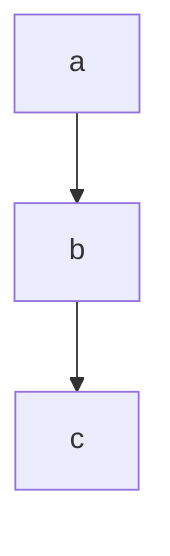
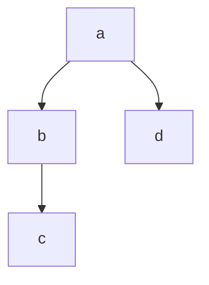
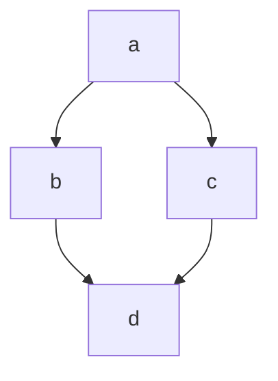
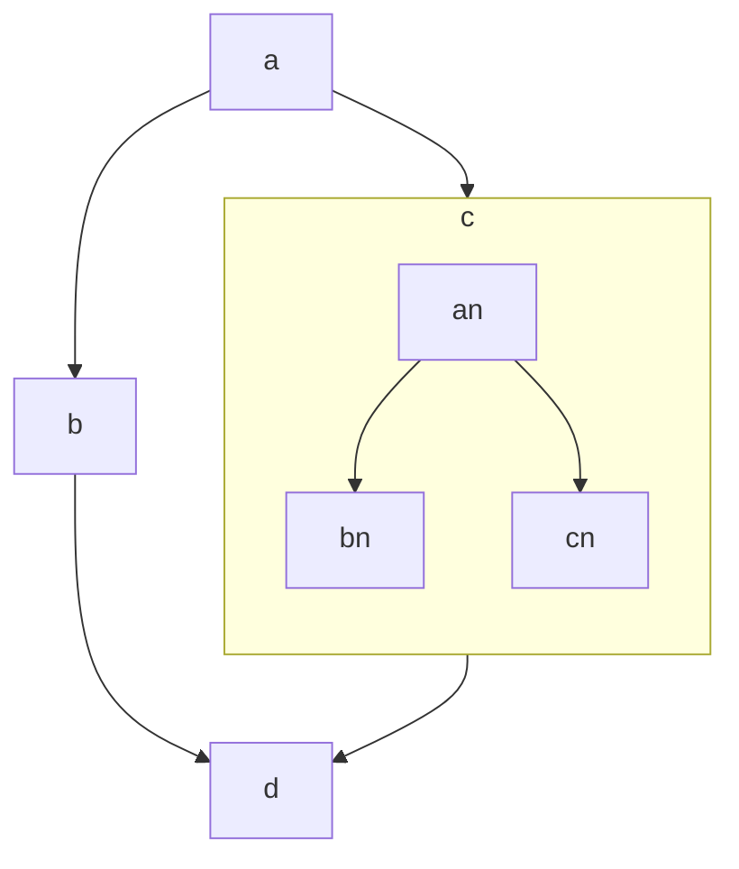
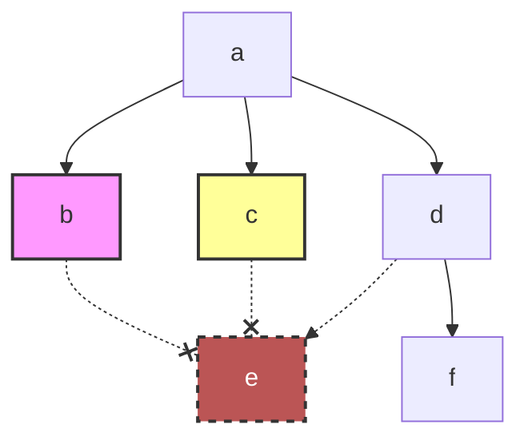
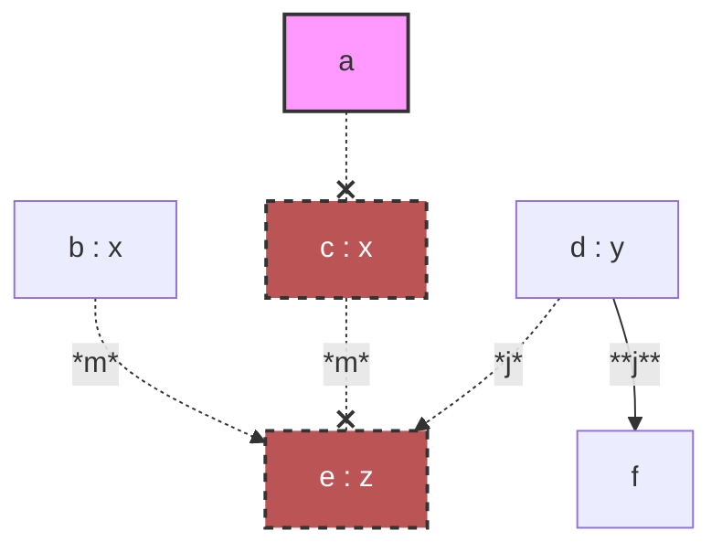
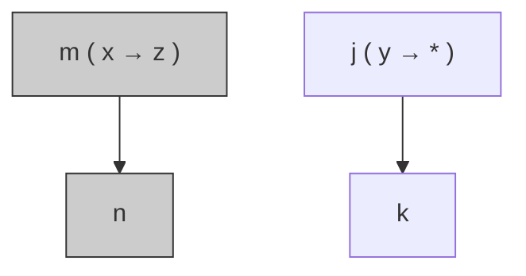

# `acyclic.h`

- A framework for building and executing asynchronous directed acyclic graphs (DAGs) using C++20 coroutines and compile-time topology specification.
- Nodes in the graph are associated with user-defined tag types. Data flows along edges, and each node can be a plain function, an awaitable, or even another acyclic instance.
- The library performs extensive compile‑time checks: uniqueness of tokens, matching of arguments/results, absence of cycles, and deducibility of functor signatures.
- It supports custom schedulers, exception handlers, and aspect‑oriented observation of data transmissions.

---

## Table of Contents

1. [Basic Usage: A Linear Chain](#basic-usage-a-linear-chain)
2. [Parameter Passing in a DAG](#parameter-passing-in-a-dag)
3. [Returning an Awaitable with Scheduler Injection](#returning-an-awaitable-with-scheduler-injection)
4. [Returning a Standard C++ Coroutine](#returning-a-standard-c-coroutine)
5. [Nesting Acyclic Instances](#nesting-acyclic-instances)
6. [Exception Handling](#exception-handling)
7. [Aspect Observation](#aspect-observation)
8. [Token Reference](#token-reference)

---

## Basic Usage: A Linear Chain

### brief

A minimal example that defines a linear topology `a → b → c`. Each node is a simple lambda that prints its input and returns a transformed value. An in‑place scheduler executes the tasks immediately when they are submitted.

### example

```c++
#include <iostream>
#include "acyclic.h"
#include "type_format.h"

struct promise;
struct coroutine : std::coroutine_handle<promise>{using promise_type = struct promise;};
struct promise{
    coroutine get_return_object(){return {coroutine::from_promise(*this)};}
    std::suspend_never initial_suspend() const noexcept{return {};}
    std::suspend_never final_suspend() const noexcept{return {};}
    void return_void() const noexcept{}
    void unhandled_exception() const noexcept{}
};

int main()
{
    using namespace fake::literals;
    
    static constexpr auto print = [](fake::view_c auto _context, const auto &..._e){
        std::cout << fake::io::fancy<>(fake::tie(_context.data(), _e...)) << std::endl;
    };
    
    // in-place scheduler
    struct in_place{void execute(std::function<void()> &&_delegate){_delegate();}};
    in_place sched;
    
    // node tags
    struct a{}; struct b{}; struct c{};
    
    // topology: a --> b; b --> c;
    using sequence = fake::top::sequence<a, b, c>;
    
    fake::acyclic_c auto acyclic = fake::bind<sequence>(
        fake::deliver(
            fake::pass<b>([](auto _x){print("b"_v, _x); return _x * 3 + 377.0;}),
            fake::pass<a>([](int _x, float _y){print("a"_v, _x, _y); return _x + _y - 114;}),
            fake::pass<fake::acyclic::token::sched<void>>(std::ref(sched)), // pass in any order
            fake::pass<c>([](auto _x){print("c"_v, _x); return _x;})
        )
    );
    
    [](auto _acyclic) -> coroutine {
        print("result"_v, co_await _acyclic(fake::pass<a>(114, 514)));
    }(std::move(acyclic));
}
```

**output (colours omitted in plain text):**

```plain
fake::flat<char [2], int32_t, float> : {
|   char [2] 0 : "a",
|   int32_t 1 : 114,
|   float 2 : 514
}
fake::flat<char [2], float> : {
|   char [2] 0 : "b",
|   float 1 : 514
}
fake::flat<char [2], double> : {
|   char [2] 0 : "c",
|   double 1 : 1919
}
fake::flat<char [7], std::tuple<double>> : {
|   char [7] 0 : "result",
|   std::tuple<double> 1 : {
|   |   double 0 : 1919
|   }
}
```

### graph



---

## Parameter Passing in a DAG

### brief

This example demonstrates how return values are distributed to subsequent nodes. Two topologies are shown:

- A **fork** where node `a` has two successors `b` and `d`; node `b` has one successor `c` that expects two arguments.
- A **diamond** where `a` forks to `b` and `c`, which then join at `d`.

The rules:

- A node with multiple successors returns a `std::tuple` whose elements are distributed to the successors in the order declared in the topology.
- If a successor expects multiple arguments, the corresponding tuple element must itself be a tuple.
- Nodes that return `void` are allowed; they simply do not contribute to the result tuple.

### example

```c++
#include <iostream>
#include <list>
#include "acyclic.h"
#include "type_format.h"

struct promise;
struct coroutine : std::coroutine_handle<promise>{using promise_type = struct promise;};
struct promise{
    coroutine get_return_object(){return {coroutine::from_promise(*this)};}
    std::suspend_never initial_suspend() const noexcept{return {};}
    std::suspend_never final_suspend() const noexcept{return {};}
    void return_void() const noexcept{}
    void unhandled_exception() const noexcept{}
};

int main()
{
    using namespace fake::literals;
    
    static constexpr auto print = [](fake::view_c auto _context, const auto &..._e){
        std::cout << fake::io::fancy<>(fake::tie(_context.data(), _e...)) << std::endl;
    };
    
    // fifo scheduler
    struct fifo{
        void run(){std::size_t i{}; while(tasks.size()) print("loop"_v, i++), tasks.front()(), tasks.pop_front();}
        void execute(std::function<void()> &&_delegate){tasks.emplace_back(std::move(_delegate));}
        std::list<std::function<void()>> tasks;
    };
    fifo sched;
    
    // node tags
    struct a{}; struct b{}; struct c{}; struct d{};
    
    // topology: a --> b; b --> c; a --> d;
    using fork = fake::top::info<
        fake::top::meta<a, fake::top::results<b, d>, fake::top::args<>>,
        fake::top::meta<b, fake::top::results<c>, fake::top::args<a>>,
        fake::top::meta<c, fake::top::results<>, fake::top::args<b>>,
        fake::top::meta<d, fake::top::results<>, fake::top::args<a>>
    >;
    
    fake::acyclic_c auto frk = fake::bind<fork>(
        fake::deliver(
            fake::pass<fake::acyclic::token::sched<void>>(std::ref(sched)),
            fake::pass<a>([](int _x, float _y){print("a"_v, _x + _y); return std::tuple{_x + _y, _x + _y + 400};}),
            // a returns a tuple because it has two successors (b and d)
            // the tuple elements are distributed in the order of the results list: first to b, second to d.
            fake::pass<b>([](auto _x){print("b"_v, _x--); return std::make_tuple(std::tuple{_x * 2 + 893, _x + 297});}),
            // b returns a tuple-of-tuple because its only successor c expects two arguments.
            fake::pass<c>([](auto _x, auto _y){print("c"_v, _x, _y);}),
            fake::pass<d>([](auto _x){print("d"_v, _x); return "foobar"_v;})
        )
    );
    
    // topology: a --> b; a --> c; b --> d; c --> d
    using diamond = fake::top::info<
        fake::top::meta<a, fake::top::results<b, c>, fake::top::args<>>,
        fake::top::meta<b, fake::top::results<d>, fake::top::args<a>>,
        fake::top::meta<c, fake::top::results<d>, fake::top::args<a>>,
        fake::top::meta<d, fake::top::results<>, fake::top::args<b, c>>
    >;
    
    fake::acyclic_c auto dia = fake::bind<diamond>(
        fake::deliver(
            fake::pass<fake::acyclic::token::sched<void>>(std::ref(sched)),
            fake::pass<a>([](int _x, float _y){print("A"_v, _x + _y); return _x + _y;}),
            fake::pass<b>([](auto _a){print("B"_v, _a); return _a + 364;}),
            fake::pass<c>([](auto _a){print("C"_v, _a); return _a + 531;}),
            fake::pass<d>([](auto _b, auto _c){print("D"_v, _b, _c); return _b + _c - 232;})
        )
    );
    
    [](auto _frk) -> coroutine {print("result<fork>"_v, co_await _frk(fake::pass<a>(50, 64)));}(std::move(frk));
    [](auto _dia) -> coroutine {print("result<diamond>"_v, co_await _dia(fake::pass<a>(114, 514)));}(std::move(dia));
    
    sched.run();
}
```

**output (colours omitted in plain text):**

```plain
fake::flat<char [5], uint64_t> : {
|   char [5] 0 : "loop",
|   uint64_t 1 : 0
}
fake::flat<char [2], float> : {
|   char [2] 0 : "a",
|   float 1 : 114
}
fake::flat<char [5], uint64_t> : {
|   char [5] 0 : "loop",
|   uint64_t 1 : 1
}
fake::flat<char [2], float> : {
|   char [2] 0 : "A",
|   float 1 : 628
}
fake::flat<char [5], uint64_t> : {
|   char [5] 0 : "loop",
|   uint64_t 1 : 2
}
fake::flat<char [2], float> : {
|   char [2] 0 : "b",
|   float 1 : 114
}
fake::flat<char [2], float, float> : {
|   char [2] 0 : "c",
|   float 1 : 1119,
|   float 2 : 410
}
fake::flat<char [5], uint64_t> : {
|   char [5] 0 : "loop",
|   uint64_t 1 : 3
}
fake::flat<char [2], float> : {
|   char [2] 0 : "d",
|   float 1 : 514
}
fake::flat<char [13], std::tuple<fake::view<'foobar'>>> : {
|   char [13] 0 : "result<fork>",
|   std::tuple<fake::view<'foobar'>> 1 : {
|   |   fake::view<'foobar'> 0 : {
|   |   |
|   |   }
|   }
}
fake::flat<char [5], uint64_t> : {
|   char [5] 0 : "loop",
|   uint64_t 1 : 4
}
fake::flat<char [2], float> : {
|   char [2] 0 : "B",
|   float 1 : 628
}
fake::flat<char [5], uint64_t> : {
|   char [5] 0 : "loop",
|   uint64_t 1 : 5
}
fake::flat<char [2], float> : {
|   char [2] 0 : "C",
|   float 1 : 628
}
fake::flat<char [5], uint64_t> : {
|   char [5] 0 : "loop",
|   uint64_t 1 : 6
}
fake::flat<char [2], float, float> : {
|   char [2] 0 : "D",
|   float 1 : 992,
|   float 2 : 1159
}
fake::flat<char [16], std::tuple<float>> : {
|   char [16] 0 : "result<diamond>",
|   std::tuple<float> 1 : {
|   |   float 0 : 1919
|   }
}
```

### graph

**Fork topology:**



**Diamond topology:**



---

## Returning an Awaitable with Scheduler Injection

### brief

Nodes can return an **awaitable** that suspends the graph execution until the awaitable completes. The library supports two protocols:

- The standard C++ coroutine protocol (`await_ready`, `await_suspend`, `await_resume`).
- An extended protocol with `await_inject(std::coroutine_handle<>, Scheduler&&)` that receives the scheduler associated with the node. This allows the awaitable to use the node’s scheduler for its own operations.

In this example, the token `b` and `c` inherit from `fake::acyclic::token::share<timer>`, which adapts a user‑defined `timer` type to the injected scheduler protocol. The `timer`’s `await_inject` spawns a thread and uses the provided scheduler (the global thread scheduler) to resume the coroutine.

### example

```c++
#include <print>
#include <sstream>
#include <list>
#include <thread>
#include "acyclic.h"
#include "type_format.h"

struct promise;
struct coroutine : std::coroutine_handle<promise>{using promise_type = struct promise;};
struct promise{
    coroutine get_return_object(){return {coroutine::from_promise(*this)};}
    std::suspend_never initial_suspend() const noexcept{return {};}
    std::suspend_never final_suspend() const noexcept{return {};}
    void return_void() const noexcept{}
    void unhandled_exception() const noexcept{}
};

struct timer{
    bool await_ready() const{return time == 0;}
    void await_inject(std::coroutine_handle<> _h, auto &&_sched) const{
        std::println("@ timer spawns a thread @");
        _sched.execute([h = std::move(_h), t = time]{std::this_thread::sleep_for(std::chrono::milliseconds{t}); h();});
    }
    auto await_resume() const{return "time = " + std::to_string(time) + ", dummy = " + std::to_string(dummy);}
    
public:
    uint64_t time = {};
    uint64_t dummy = 893;
};

int main()
{
    using namespace fake::literals;
    
    static constexpr auto print = [](fake::view_c auto _context, const auto &..._e){
        std::ostringstream oss;
        oss << fake::io::fancy<>(fake::tie(_context.data(), _e...));
        std::println("{}", oss.str());
    };
    
    // thread scheduler
    struct thread{
        std::size_t size(){fake::atomic::read guard(mutex); return tasks.size();};
        void join(){
            while(size()){
                std::thread* ptr;
                {fake::atomic::read guard(mutex); ptr = &tasks.front();}
                {ptr->join(); fake::atomic::write guard(mutex); tasks.pop_front();}
            }
        }
        void execute(std::function<void()> &&_delegate){
            fake::atomic::write guard(mutex);
            print("loop"_v, i++), tasks.emplace_back(std::move(_delegate));
        }
        ~thread(){join();}
        std::size_t i{};
        fake::atomic::guard mutex;
        std::list<std::thread> tasks;
    };
    thread sched;
    
    // bind reverse injection awaitable 'timer'
    using time = fake::acyclic::token::share<timer>;
    
    // node tags
    struct a{}; struct b : time{}; struct c : time{}; struct d{};
    
    // topology: a --> c; a --> b; c --> d; b --> d;
    using fork = fake::top::info<
        fake::top::meta<a, fake::top::results<c, b>, fake::top::args<>>,
        fake::top::meta<b, fake::top::results<d>, fake::top::args<a>>,
        fake::top::meta<c, fake::top::results<d>, fake::top::args<a>>,
        fake::top::meta<d, fake::top::results<>, fake::top::args<c, b>>
    >;
    
    fake::acyclic_c auto acyclic = fake::bind<fork>(
        fake::deliver(
            fake::pass<fake::acyclic::token::sched<void>>(std::ref(sched)),
            fake::pass<a>([](int _x){print("a"_v, _x); return std::tuple{_x + 400, _x + 250};}),
            fake::pass<b>([](auto _x){print("b"_v, _x); return _x - 364;}),
            fake::pass<c>([](auto _x){print("c"_v, _x); return fake::pass(810, 1919);}),
            fake::pass<d>([](const auto &_b, const auto &_c){print("d"_v, _b, _c); return std::pair{_b, _c};})
        )
    );
    
    [](auto _acyclic) -> coroutine {print("result"_v, co_await _acyclic(fake::pass<a>(114)));}(std::move(acyclic));
    [](auto _acyclic) -> coroutine {print("result"_v, co_await _acyclic(fake::pass<a>(514)));}(std::move(acyclic));
}
```

**output (colours omitted in plain text):**

```plain
fake::flat<char [5], uint64_t> : {
|   char [5] 0 : "loop",
|   uint64_t 1 : 0
}
fake::flat<char [5], uint64_t> : {
|   char [5] 0 : "loop",
|   uint64_t 1 : 1
}
fake::flat<char [2], int32_t> : {
|   char [2] 0 : "a",
|   int32_t 1 : 514
}
fake::flat<char [2], int32_t> : {
|   char [2] 0 : "a",
|   int32_t 1 : 114
}
fake::flat<char [5], uint64_t> : {
|   char [5] 0 : "loop",
|   uint64_t 1 : 2
}
fake::flat<char [5], uint64_t> : {
|   char [5] 0 : "loop",
|   uint64_t 1 : 3
}
fake::flat<char [2], int32_t> : {
|   char [2] 0 : "c",
|   int32_t 1 : 914
}
fake::flat<char [5], uint64_t> : {
|   char [5] 0 : "loop",
|   uint64_t 1 : 4
}
@ timer spawns a thread @
fake::flat<char [2], int32_t> : {
|   char [2] 0 : "c",
|   int32_t 1 : 514
}
fake::flat<char [5], uint64_t> : {
|   char [5] 0 : "loop",
|   uint64_t 1 : 5
}
@ timer spawns a thread @
fake::flat<char [2], int32_t> : {
|   char [2] 0 : "b",
|   int32_t 1 : 764
}
fake::flat<char [5], uint64_t> : {
|   char [5] 0 : "loop",
|   uint64_t 1 : 6
}
fake::flat<char [2], int32_t> : {
|   char [2] 0 : "b",
|   int32_t 1 : 364
}
fake::flat<char [5], uint64_t> : {
|   char [5] 0 : "loop",
|   uint64_t 1 : 7
}
@ timer spawns a thread @
fake::flat<char [5], uint64_t> : {
|   char [5] 0 : "loop",
|   uint64_t 1 : 8
}
fake::flat<char [5], uint64_t> : {
|   char [5] 0 : "loop",
|   uint64_t 1 : 9
}
fake::flat<char [5], uint64_t> : {
|   char [5] 0 : "loop",
|   uint64_t 1 : 10
}
fake::flat<char [2], std::string, std::string> : {
|   char [2] 0 : "d",
|   std::string 1 : "time = 810, dummy = 1919",
|   std::string 2 : "time = 0, dummy = 893"
}
fake::flat<char [2], std::string, std::string> : {
|   char [2] 0 : "d",
|   std::string 1 : "time = 810, dummy = 1919",
|   std::string 2 : "time = 400, dummy = 893"
}
fake::flat<char [7], std::tuple<std::pair<std::string, std::string>>> : {
|   char [7] 0 : "result",
|   std::tuple<std::pair<std::string, std::string>> 1 : {
|   |   std::pair<std::string, std::string> 0 : {
|   |   |   std::string first : "time = 810, dummy = 1919",
|   |   |   std::string second : "time = 0, dummy = 893"
|   |   }
|   }
}
fake::flat<char [7], std::tuple<std::pair<std::string, std::string>>> : {
|   char [7] 0 : "result",
|   std::tuple<std::pair<std::string, std::string>> 1 : {
|   |   std::pair<std::string, std::string> 0 : {
|   |   |   std::string first : "time = 810, dummy = 1919",
|   |   |   std::string second : "time = 400, dummy = 893"
|   |   }
|   }
}
```

### graph


---

## Returning a Standard C++ Coroutine

### brief

Nodes can also return a hand‑written coroutine that follows the standard protocol (`await_ready`, `await_suspend`, `await_resume`). In this case the coroutine itself may suspend and resume, and it can contain its own `co_await` expressions. The library treats such a coroutine object as an awaitable.

In this example, node `b` returns a coroutine that loops three times, each time awaiting a `timer` that spawns a thread. The `timer` here does **not** use scheduler injection; it captures the scheduler explicitly.

### example

```c++
#include <print>
#include <sstream>
#include <list>
#include <thread>
#include "acyclic.h"
#include "type_format.h"

struct promise;
struct coroutine : std::coroutine_handle<promise>{
    using promise_type = struct promise;
    inline void await_suspend(std::coroutine_handle<> _h);
    inline int await_resume() const;
    inline bool await_ready() const{return false;}
};
struct promise{
    coroutine get_return_object(){return {coroutine::from_promise(*this)};}
    std::suspend_always initial_suspend() const noexcept{return {};}
    std::suspend_never final_suspend() const noexcept{if(handle) handle(); return {};}
    void return_value(int _result) noexcept{result = _result;}
    void unhandled_exception() const noexcept{}
    
    std::coroutine_handle<> handle;
    int result;
};
inline void coroutine::await_suspend(std::coroutine_handle<> _h){promise().handle = _h; resume();}
inline int coroutine::await_resume() const{return promise().result;}

template<typename _Scheduler>
struct timer{
    bool await_ready() const{return time == 0;}
    void await_suspend(std::coroutine_handle<> _h) const{
        std::println("@ timer spawns a thread @");
        sched.execute([h = std::move(_h), t = time]{std::this_thread::sleep_for(std::chrono::milliseconds{t}); h();});
    }
    auto await_resume() const{return "time = " + std::to_string(time) + ", dummy = " + std::to_string(dummy);}
    
public:
    _Scheduler &sched;
    uint64_t time = {};
    uint64_t dummy = 893;
};

int main()
{
    using namespace fake::literals;
    
    static constexpr auto print = [](fake::view_c auto _context, const auto &..._e){
        std::ostringstream oss;
        oss << fake::io::fancy<>(fake::tie(_context.data(), _e...));
        std::println("{}", oss.str());
    };
    
    // thread scheduler
    struct thread{
        std::size_t size(){fake::atomic::read guard(mutex); return tasks.size();};
        void join(){
            while(size()){
                std::thread* ptr;
                {fake::atomic::read guard(mutex); ptr = &tasks.front();}
                {ptr->join(); fake::atomic::write guard(mutex); tasks.pop_front();}
            }
        }
        void execute(std::function<void()> &&_delegate){
            fake::atomic::write guard(mutex);
            print("loop"_v, i++), tasks.emplace_back(std::move(_delegate));
        }
        ~thread(){join();}
        std::size_t i{};
        fake::atomic::guard mutex;
        std::list<std::thread> tasks;
    };
    thread sched;
    
    // node tags
    struct a{}; struct b : fake::acyclic::token::await{}; struct c{}; struct d{};
    
    // topology: a --> b; a --> c; b --> d; c --> d;
    using diamond = fake::top::info<
        fake::top::meta<a, fake::top::results<b, c>, fake::top::args<>>,
        fake::top::meta<b, fake::top::results<d>, fake::top::args<a>>,
        fake::top::meta<c, fake::top::results<d>, fake::top::args<a>>,
        fake::top::meta<d, fake::top::results<>, fake::top::args<b, c>>
    >;
    
    fake::acyclic_c auto dia = fake::bind<diamond>(
        fake::deliver(
            fake::pass<fake::acyclic::token::sched<void>>(std::ref(sched)),
            fake::pass<a>([](int _x){print("a"_v, _x); return std::tuple(_x + 400, 1402);}),
            fake::pass<b>(
                [&sched](auto _x){
                    print("b"_v, _x);
                    return [](auto _x, auto &_sched) -> coroutine {
                        for(int i = 0; i < 3; i++)
                            print("coro"_v, _x++), co_await timer{_sched, 300};
                        co_return _x;
                    }(_x, sched);
                }
            ),
            fake::pass<c>([](auto _x){print("c"_v, _x); return _x;}),
            fake::pass<d>([](auto _x, auto _y){print("d"_v, _x + _y); return std::pair{_x, _y};})
        )
    );
    
    auto coro = [](auto _dia) -> coroutine {print("result"_v, co_await _dia(fake::pass<a>(114)));}(std::move(dia));
    coro(); // initial_suspend returns suspend_always, so we need to manually resume
}
```

**output (colours omitted in plain text):**

```plain
fake::flat<char [5], uint64_t> : {
|   char [5] 0 : "loop",
|   uint64_t 1 : 0
}
fake::flat<char [2], int32_t> : {
|   char [2] 0 : "a",
|   int32_t 1 : 114
}
fake::flat<char [5], uint64_t> : {
|   char [5] 0 : "loop",
|   uint64_t 1 : 1
}
fake::flat<char [5], uint64_t> : {
|   char [5] 0 : "loop",
|   uint64_t 1 : 2
}
fake::flat<char [2], int32_t> : {
|   char [2] 0 : "b",
|   int32_t 1 : 514
}
@ timer spawns a thread @
fake::flat<char [2], int32_t> : {
|   char [2] 0 : "c",
|   int32_t 1 : 1402
}
fake::flat<char [5], uint64_t> : {
|   char [5] 0 : "loop",
|   uint64_t 1 : 3
}
fake::flat<char [5], int32_t> : {
|   char [5] 0 : "coro",
|   int32_t 1 : 514
}
@ timer spawns a thread @
fake::flat<char [5], uint64_t> : {
|   char [5] 0 : "loop",
|   uint64_t 1 : 4
}
fake::flat<char [5], int32_t> : {
|   char [5] 0 : "coro",
|   int32_t 1 : 515
}
@ timer spawns a thread @
fake::flat<char [5], uint64_t> : {
|   char [5] 0 : "loop",
|   uint64_t 1 : 5
}
fake::flat<char [5], int32_t> : {
|   char [5] 0 : "coro",
|   int32_t 1 : 516
}
fake::flat<char [5], uint64_t> : {
|   char [5] 0 : "loop",
|   uint64_t 1 : 6
}
fake::flat<char [2], int32_t> : {
|   char [2] 0 : "d",
|   int32_t 1 : 1919
}
fake::flat<char [7], std::tuple<std::pair<int32_t, int32_t>>> : {
|   char [7] 0 : "result",
|   std::tuple<std::pair<int32_t, int32_t>> 1 : {
|   |   std::pair<int32_t, int32_t> 0 : {
|   |   |   int32_t first : 517,
|   |   |   int32_t second : 1402
|   |   }
|   }
}
```

### graph


---

## Nesting Acyclic Instances

### brief

An acyclic instance itself can be returned from a node; it becomes an awaitable. This allows building hierarchical graphs: an outer DAG can contain nodes that are entire inner DAGs.

In this example, node `c` in the outer DAG returns a nested acyclic instance (`nest`) that has its own three‑node DAG. The outer DAG waits for the inner DAG to complete before continuing.

### example

```c++
#include <print>
#include <sstream>
#include <list>
#include <thread>
#include "acyclic.h"
#include "type_format.h"

struct promise;
struct coroutine : std::coroutine_handle<promise>{using promise_type = struct promise;};
struct promise{
    coroutine get_return_object(){return {coroutine::from_promise(*this)};}
    std::suspend_never initial_suspend() const noexcept{return {};}
    std::suspend_never final_suspend() const noexcept{return {};}
    void return_void() const noexcept{}
    void unhandled_exception() const noexcept{}
};

int main()
{
    using namespace fake::literals;
    
    static constexpr auto print = [](fake::view_c auto _context, const auto &..._e){
        std::ostringstream oss;
        oss << fake::io::fancy<>(fake::tie(_context.data(), _e...));
        std::println("{}", oss.str());
    };
    
    // thread scheduler
    struct thread{
        std::size_t size(){fake::atomic::read guard(mutex); return tasks.size();};
        void join(){
            while(size()){
                std::thread* ptr;
                {fake::atomic::read guard(mutex); ptr = &tasks.front();}
                {ptr->join(); fake::atomic::write guard(mutex); tasks.pop_front();}
            }
        }
        void execute(std::function<void()> &&_delegate){
            fake::atomic::write guard(mutex);
            print("loop"_v, i++), tasks.emplace_back(std::move(_delegate));
        }
        ~thread(){join();}
        std::size_t i{};
        fake::atomic::guard mutex;
        std::list<std::thread> tasks;
    };
    thread sched;
    
    // inner DAG node tags
    struct an{}; struct bn{}; struct cn{};
    
    // inner topology: an --> bn; an --> cn;
    using nest_t = fake::top::info<
        fake::top::meta<an, fake::top::results<bn, cn>, fake::top::args<>>,
        fake::top::meta<bn, fake::top::results<>, fake::top::args<an>>,
        fake::top::meta<cn, fake::top::results<>, fake::top::args<an>>
    >;
    
    // outer DAG node tags
    struct a{}; struct b{}; struct c : fake::acyclic::token::await, fake::acyclic::token::dupli{}; struct d{};
    
    // outer topology: a --> b; a --> c; b --> d; c --> d;
    using topology_t = fake::top::info<
        fake::top::meta<a, fake::top::results<b, c>, fake::top::args<>>,
        fake::top::meta<b, fake::top::results<d>, fake::top::args<a>>,
        fake::top::meta<c, fake::top::results<d>, fake::top::args<a>>,
        fake::top::meta<d, fake::top::results<>, fake::top::args<b, c>>
    >;
    
    // build inner acyclic instance
    fake::acyclic_c auto nest = fake::bind<nest_t>(
        fake::deliver(
            fake::pass<fake::acyclic::token::sched<void>>(std::ref(sched)),
            fake::pass<an>([](int _x){print("an"_v, _x); return std::tuple(_x + 1405, _x + 296);}),
            fake::pass<bn>([](auto _x){print("bn"_v, _x); return _x;}),
            fake::pass<cn>([](auto _x){print("cn"_v, _x); return _x;})
        )
    );
    
    // outer acyclic instance uses the inner one as node c
    fake::acyclic_c auto acyclic = fake::bind<topology_t>(
        fake::deliver(
            fake::pass<fake::acyclic::token::sched<void>>(std::ref(sched)),
            fake::pass<a>([](int _x){print("a"_v, _x); return std::tuple(_x, _x + 400);}),
            fake::pass<b>([](auto _x){print("b"_v, _x); return _x + 250;}),
            fake::pass<c>([n = std::move(nest)](auto _x){print("c"_v, _x); return n(fake::pass<an>(_x));}),
            fake::pass<d>([](auto _x, auto _y, auto _z){print("d"_v, _x, _y - _z - 216);})
        )
    );
    
    [](auto _acyclic) -> coroutine {print("result"_v, co_await _acyclic(fake::pass<a>(114)));}(std::move(acyclic));
}
```

**output (colours omitted in plain text):**

```plain
fake::flat<char [5], uint64_t> : {
|   char [5] 0 : "loop",
|   uint64_t 1 : 0
}
fake::flat<char [2], int32_t> : {
|   char [2] 0 : "a",
|   int32_t 1 : 114
}
fake::flat<char [5], uint64_t> : {
|   char [5] 0 : "loop",
|   uint64_t 1 : 1
}
fake::flat<char [2], int32_t> : {
|   char [2] 0 : "b",
|   int32_t 1 : 114
}
fake::flat<char [5], uint64_t> : {
|   char [5] 0 : "loop",
|   uint64_t 1 : 2
}
fake::flat<char [2], int32_t> : {
|   char [2] 0 : "c",
|   int32_t 1 : 514
}
fake::flat<char [5], uint64_t> : {
|   char [5] 0 : "loop",
|   uint64_t 1 : 3
}
fake::flat<char [3], int32_t> : {
|   char [3] 0 : "an",
|   int32_t 1 : 514
}
fake::flat<char [5], uint64_t> : {
|   char [5] 0 : "loop",
|   uint64_t 1 : 4
}
fake::flat<char [5], uint64_t> : {
|   char [5] 0 : "loop",
|   uint64_t 1 : 5
}
fake::flat<char [3], int32_t> : {
|   char [3] 0 : "bn",
|   int32_t 1 : 1919
}
fake::flat<char [3], int32_t> : {
|   char [3] 0 : "cn",
|   int32_t 1 : 810
}
fake::flat<char [5], uint64_t> : {
|   char [5] 0 : "loop",
|   uint64_t 1 : 6
}
fake::flat<char [2], int32_t, int32_t> : {
|   char [2] 0 : "d",
|   int32_t 1 : 364,
|   int32_t 2 : 893
}
fake::flat<char [7], std::tuple<>> : {
|   char [7] 0 : "result",
|   std::tuple<> 1 : {
|   |
|   }
}
```

### graph



---

## Exception Handling

### brief

The library allows associating exception handlers with groups of nodes using `fake::acyclic::token::spare<Group>`. When a node belonging to that group throws an exception, the handler is invoked. If a node that produces data for other nodes throws, those downstream nodes may not execute, unless they do not depend on the thrown‑away data (i.e., they return `void` and have no data dependency).

In this example, nodes `b` and `c` (belonging to groups `x` and `y`) throw. The exceptions are caught by the corresponding handlers. Node `e` depends on `b`, `c`, and `d`; because `b` and `c` throw, `e` never runs. Node `f` depends only on `d` and runs normally. The exception `bad optional access` raised by the acyclic instance is eventually passed to the coroutine through its `co_await`, since the acyclic instance attempts to obtain the final result and `await_resume` it as the return value of the `co_await` expression but misses the return data from `e`.

### example

```c++
#include <print>
#include <sstream>
#include <list>
#include <thread>
#include "acyclic.h"
#include "type_format.h"

struct promise;
struct coroutine : std::coroutine_handle<promise>{using promise_type = struct promise;};
struct promise{
    coroutine get_return_object(){return {coroutine::from_promise(*this)};}
    std::suspend_never initial_suspend() const noexcept{return {};}
    std::suspend_never final_suspend() const noexcept{std::println("final_suspend()"); return {};}
    void return_void() const noexcept{}
    void unhandled_exception() const noexcept{std::println("unhandled_exception()");}
};

int main()
{
    using namespace fake::literals;
    
    static constexpr auto print = [](fake::view_c auto _context, const auto &..._e){
        std::ostringstream oss;
        oss << fake::io::fancy<>(fake::tie(_context.data(), _e...));
        std::println("{}", oss.str());
    };
    
    // thread scheduler
    struct thread{
        std::size_t size(){fake::atomic::read guard(mutex); return tasks.size();};
        void join(){
            while(size()){
                std::thread* ptr;
                {fake::atomic::read guard(mutex); ptr = &tasks.front();}
                {ptr->join(); fake::atomic::write guard(mutex); tasks.pop_front();}
            }
        }
        void execute(std::function<void()> &&_delegate){
            fake::atomic::write guard(mutex);
            print("loop"_v, i++), tasks.emplace_back(std::move(_delegate));
        }
        ~thread(){join();}
        std::size_t i{};
        fake::atomic::guard mutex;
        std::list<std::thread> tasks;
    };
    thread sched;
    
    // exception handler tags by group
    struct x{}; struct y{};
    
    // node tags
    struct a{}; struct b : x{}; struct c : y{}; struct d{}; struct e{}; struct f{};
    
    // topology: a --> b; a --> c; a --> d; b(throw) --> e; c(throw) --> e; d --> e; d --> f;
    using topology_t = fake::top::info<
        fake::top::meta<a, fake::top::results<b, c, d>, fake::top::args<>>,
        fake::top::meta<b, fake::top::results<e>, fake::top::args<a>>,
        fake::top::meta<c, fake::top::results<e>, fake::top::args<a>>,
        fake::top::meta<d, fake::top::results<e, f>, fake::top::args<a>>,
        fake::top::meta<e, fake::top::results<>, fake::top::args<b, c, d>>,
        fake::top::meta<f, fake::top::results<>, fake::top::args<d>>
    >;
    
    struct result final{std::string value = "node ignored";};
    
    fake::acyclic_c auto acyclic = fake::bind<topology_t>(
        fake::deliver(
            fake::pass<fake::acyclic::token::sched<void>>(std::ref(sched)),
            fake::pass<fake::acyclic::token::spare<x>>(
                []{
                    auto eptr = std::current_exception();
                    try{if(eptr) std::rethrow_exception(eptr);}catch(int _e){print("exception_handler<x>"_v, _e);}
                }
            ),
            fake::pass<fake::acyclic::token::spare<y>>(
                []{
                    auto eptr = std::current_exception();
                    try{if(eptr) std::rethrow_exception(eptr);}catch(int _e){print("exception_handler<y>"_v, _e);}
                }
            ),
            fake::pass<a>([]{print("a"_v); return std::tuple{114, 514, 1919};}),
            fake::pass<b>([](auto _x){print("b(throw)"_v); throw _x; return _x;}),
            fake::pass<c>([](auto _x){print("c(throw)"_v); throw _x; return _x;}),
            fake::pass<d>([](auto _x){print("d"_v); return std::tuple{_x, std::tuple{}};}),
            fake::pass<e>(
                [](auto _x, auto _y, auto _z){
                    print("e"_v, _x + _y + _z);
                    return result{"node<e> invoked"};
                }
            ),
            fake::pass<f>([]{print("f"_v); return result{"node<f> invoked"};})
        )
    );
    
    [](auto _acyclic) -> coroutine {
        fake::scope_guard guard{[]{std::println("~coroutine()");}};
        print("result"_v, co_await _acyclic(fake::pass<a>()));
    }(std::move(acyclic));
    
    sched.join();
    
    std::println("~main()");
}
```

**output (colours omitted in plain text):**

```plain
fake::flat<char [5], uint64_t> : {
|   char [5] 0 : "loop",
|   uint64_t 1 : 0
}
fake::flat<char [2]> : {
|   char [2] 0 : "a"
}
fake::flat<char [5], uint64_t> : {
|   char [5] 0 : "loop",
|   uint64_t 1 : 1
}
fake::flat<char [5], uint64_t> : {
|   char [5] 0 : "loop",
|   uint64_t 1 : 2
}
fake::flat<char [9]> : {
|   char [9] 0 : "b(throw)"
}
fake::flat<char [5], uint64_t> : {
|   char [5] 0 : "loop",
|   uint64_t 1 : 3
}
fake::flat<char [21], int32_t> : {
|   char [21] 0 : "exception_handler<x>",
|   int32_t 1 : 114
}
fake::flat<char [9]> : {
|   char [9] 0 : "c(throw)"
}
fake::flat<char [2]> : {
|   char [2] 0 : "d"
}
fake::flat<char [21], int32_t> : {
|   char [21] 0 : "exception_handler<y>",
|   int32_t 1 : 514
}
fake::flat<char [5], uint64_t> : {
|   char [5] 0 : "loop",
|   uint64_t 1 : 4
}
fake::flat<char [2]> : {
|   char [2] 0 : "f"
}
~coroutine()
unhandled_exception()
final_suspend()
~main()
```

### graph



---

## Aspect Observation

### brief

Aspects are observation points attached to data transmissions between nodes. They can intercept the data flowing from a source node to a target node, potentially modify it, and pass it along. Aspects are defined by a separate DAG (`aspect_t`) whose nodes are triggered when the corresponding transmission occurs.

In this example, we define two aspect chains:

- `m → n` observes transmissions from any node in group `x` to any node in group `z`.
- `j → k` observes transmissions from any node in group `y` to any node (void matches any). Because node `e` (in group `z`) does not run due to an exception, the `m→n` chain is not triggered. The `j→k` chain is triggered for the transmission `d→f`.

Aspects can modify the data; here `j` negates the observed values before passing them to `k` and finally to the target node `f`.

### example

```c++
#include <print>
#include <sstream>
#include <list>
#include <thread>
#include <memory>
#include "acyclic.h"
#include "type_format.h"

struct promise;
struct coroutine : std::coroutine_handle<promise>{using promise_type = struct promise;};
struct promise{
    coroutine get_return_object(){return {coroutine::from_promise(*this)};}
    std::suspend_never initial_suspend() const noexcept{return {};}
    std::suspend_never final_suspend() const noexcept{std::println("final_suspend()"); return {};}
    void return_void() const noexcept{}
    void unhandled_exception() const noexcept{std::println("unhandled_exception()");}
};

int main()
{
    using namespace fake::literals;
    
    static constexpr auto print = [](fake::view_c auto _context, const auto &..._e){
        std::ostringstream oss;
        oss << fake::io::fancy<>(fake::tie(_context.data(), _e...));
        std::println("{}", oss.str());
    };
    
    // thread scheduler
    struct thread{
        std::size_t size(){fake::atomic::read guard(mutex); return tasks.size();};
        void join(){
            while(size()){
                std::thread* ptr;
                {fake::atomic::read guard(mutex); ptr = &tasks.front();}
                {ptr->join(); fake::atomic::write guard(mutex); tasks.pop_front();}
            }
        }
        void execute(std::function<void()> &&_delegate){
            fake::atomic::write guard(mutex);
            print("loop"_v, i++), tasks.emplace_back(std::move(_delegate));
        }
        ~thread(){join();}
        std::size_t i{};
        fake::atomic::guard mutex;
        std::list<std::thread> tasks;
    };
    thread sched;
    
    // group tags
    struct x{}; struct y{}; struct z{}; struct p{};
    
    // node tags
    struct a : p{}; struct b : x{}; struct c : x{}; struct d : y{}; struct e : z{}; struct f{};
    
    // main topology: a(throw) --> c; b --> e; c --> e; d --> e; d --> f;
    using topology_t = fake::top::info<
        fake::top::meta<a, fake::top::results<c>, fake::top::args<>>,
        fake::top::meta<b, fake::top::results<e>, fake::top::args<>>,
        fake::top::meta<c, fake::top::results<e>, fake::top::args<a>>,
        fake::top::meta<d, fake::top::results<e, f>, fake::top::args<>>,
        fake::top::meta<e, fake::top::results<>, fake::top::args<b, c, d>>,
        fake::top::meta<f, fake::top::results<>, fake::top::args<d>>
    >;
    
    // aspect tags
    struct m{}; struct n{}; struct j : fake::acyclic::token::dupli{}; struct k{};
    
    // aspect topology: m --> n; j --> k;
    using aspect_t = fake::top::info<
        fake::top::meta<m, fake::top::results<n>, fake::top::observer<x, z>>,
        fake::top::meta<n, fake::top::results<>, fake::top::args<m>>,
        
        fake::top::meta<j, fake::top::results<k>, fake::top::observer<y, void>>,
        fake::top::meta<k, fake::top::results<>, fake::top::args<j>>
    >;
    
    auto topology = fake::deliver(
        fake::pass<fake::acyclic::token::sched<void>>(std::ref(sched)),
        fake::pass<fake::acyclic::token::spare<p>>(
            []{
                auto eptr = std::current_exception();
                try{if(eptr) std::rethrow_exception(eptr);}catch(int _e){print("exception_handler<p>"_v, _e);}
            }
        ),
        fake::pass<a>([]{throw 364; return 931;}),
        fake::pass<b>([](int _x){return _x;}),
        fake::pass<c>([](auto _x){return _x;}),
        fake::pass<d>([](int _x){return std::make_tuple(_x, std::tuple(1919, 810));}),
        fake::pass<e>([](auto ..._e){print("e"_v, _e...);}),
        fake::pass<f>([](auto ..._f){print("f"_v, _f...);})
    );
    
    auto aspect = fake::deliver(
        fake::pass<fake::acyclic::token::sched<void>>(std::ref(sched)),
        fake::pass<m>(
            [](auto _info, auto &_obs){
                print("m"_v, fake::type_view(_info), _obs++);
                return _obs;
            }
        ),
        fake::pass<n>([](auto _copy){print("n"_v, _copy);}),
        
        fake::pass<j>(
            [](auto _info, auto &..._obs){
                print("j"_v, fake::type_view(_info), _obs...);
                return std::tuple(_obs = -_obs...);
            }
        ),
        fake::pass<k>([](auto ..._copy){print("k"_v, _copy...);})
    );
    
    fake::acyclic_c auto acyclic = fake::bind<topology_t, aspect_t>(std::move(topology), std::move(aspect));
    
    [](auto _acyclic) -> coroutine {
        fake::scope_guard guard{[]{std::println("~coroutine()");}};
        
        auto awaitable = _acyclic(fake::pass<a>(), fake::pass<b>(114), fake::pass<d>(514));
        
        awaitable.await_aspect(
            []() -> coroutine {
                co_await std::suspend_always{};
                fake::scope_guard guard{[]{std::println("~aspect()");}};
                print("@aspect done"_v);
                co_return;
            }()
        );
        
        print("result"_v, co_await awaitable);
    }(std::move(acyclic));
    
    sched.join();
    
    std::println("~main()");
}
```

**output (colours omitted in plain text):**

```plain
fake::flat<char [5], uint64_t> : {
|   char [5] 0 : "loop",
|   uint64_t 1 : 0
}
fake::flat<char [5], uint64_t> : {
|   char [5] 0 : "loop",
|   uint64_t 1 : 1
}
fake::flat<char [5], uint64_t> : {
|   char [5] 0 : "loop",
|   uint64_t 1 : 2
}
fake::flat<char [21], int32_t> : {
|   char [21] 0 : "exception_handler<p>",
|   int32_t 1 : 364
}
fake::flat<char [5], uint64_t> : {
|   char [5] 0 : "loop",
|   uint64_t 1 : 3
}
fake::flat<char [2], fake::view<'fake::execution::topology::meta<main()::j, fake::execution::topology::observer<main()::y, void>, fake::execution::topology::observer<main()::d, main()::f> >'>, int32_t, int32_t> : {
|   char [2] 0 : "j",
|   fake::view<'fake::execution::topology::meta<main()::j, fake::execution::topology::observer<main()::y, void>, fake::execution::topology::observer<main()::d, main()::f> >'> 1 : {
|   |
|   },
|   int32_t 2 : 1919,
|   int32_t 3 : 810
}
fake::flat<char [2], int32_t, int32_t> : {
|   char [2] 0 : "k",
|   int32_t 1 : -1919,
|   int32_t 2 : -810
}
fake::flat<char [2], int32_t, int32_t> : {
|   char [2] 0 : "f",
|   int32_t 1 : -1919,
|   int32_t 2 : -810
}
fake::flat<char [7], std::tuple<>> : {
|   char [7] 0 : "result",
|   std::tuple<> 1 : {
|   |
|   }
}
~coroutine()
final_suspend()
fake::flat<char [13]> : {
|   char [13] 0 : "@aspect done"
}
~aspect()
final_suspend()
~main()
```

### graph

**Main DAG with groups:**



**Aspect DAG:**



**Observed transmissions:**

- `x → z` (b→e, c→e) → triggers `m→n` – but e does not run due to exception, so no trigger.
- `y → *` (d→e, d→f) → triggers `j→k`; only d→f occurs.

---

## Token Reference

### brief

`fake::acyclic` uses tag types (tokens) to associate metadata with nodes, schedulers, exception handlers, and aspects. Tokens can be combined through inheritance to form groups. The library provides several predefined token templates that control node behaviour.

### `fake::acyclic::token::sched<_Token>`

Marks a value passed via `fake::pass` as a scheduler. The template parameter `_Token` specifies which node tags this scheduler should be used for (matching via `std::derived_from`). A scheduler must satisfy the `scheduler_c` concept: it must have an `execute` member that accepts a task (a `std::function<void()>` or a template‑typed callable). Two forms are recognized:

- `scheduler.execute(task)` – trivial scheduler.
- `scheduler.template execute<node_t>(task)` – meta scheduler that receives the node tag as a template argument.

Usage: `fake::pass<fake::acyclic::token::sched<Group>>(std::ref(my_scheduler))`.

### `fake::acyclic::token::await`

A base tag. If a node’s tag inherits from `await`, the return value of that node is treated as an awaitable. The library will suspend the graph and resume when the awaitable completes. The awaitable may follow the standard coroutine protocol or the extended `await_inject` protocol.

### `fake::acyclic::token::split`

Disables the automatic basic‑block merging optimization. Normally, the library may inline a chain of non‑await nodes that share the same scheduler into a single scheduling event. Inheriting from `split` forces the node to be scheduled separately.

### `fake::acyclic::token::fixed`

Controls how arguments are passed to the node’s functor. By default, if the incoming data is a `std::tuple`, it is applied to the functor via `std::apply`. With `fixed`, the tuple is passed as‑is (the functor must accept a tuple). Useful when the node expects a tuple directly.

### `fake::acyclic::token::dupli`

By default, a node with multiple successors distributes its return tuple element‑wise. If `dupli` is inherited, the node returns a single value, and that value is passed by reference (duplicated) to all successors. If the value is modified in one successor, the change is visible to others (be careful with concurrency).

### `fake::acyclic::token::adapt<_Promise, _Inject>`

An adapter that makes a coroutine type with a given promise `_Promise` usable as an awaitable returned from a node. If `_Inject` is `true`, the coroutine is expected to provide an `await_inject` method that receives the node’s scheduler.

### `fake::acyclic::token::share<_Base, _reference>`

A convenience adapter built on `adapt`. It automatically transforms a user‑defined awaitable type `_Base` that implements the `await_inject` protocol. The `_reference` parameter controls whether the injected scheduler is passed by reference or by value.

### `fake::acyclic::token::spare<_Token>`

Marks a value as an exception handler. The handler is invoked when a node whose tag derives from `_Token` throws an unhandled exception. The handler is a callable taking no arguments; it can retrieve the current exception via `std::current_exception()`.
